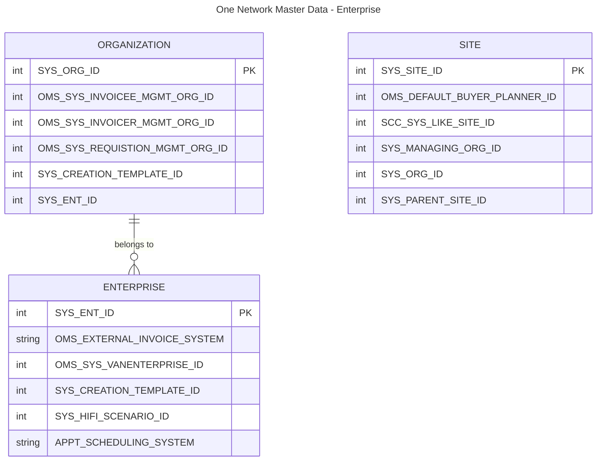
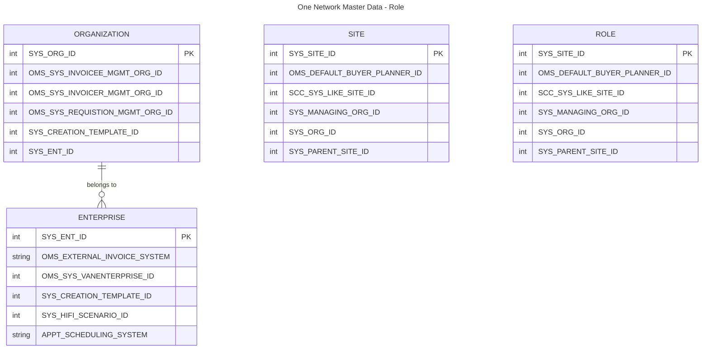
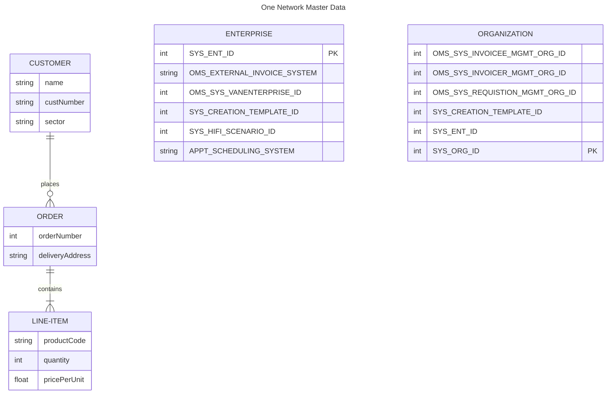

# USAID SCCT - Data Models

This page contains details on the various data models related to the SCCT environments.  It includes information related to how models are created and maintained as well as any automation processes utilized to manage and update information.

[TOC levels=2]: # "### Table of contents"

## Creating Data Dictionary

Automating the creation and updates of data dictionary related information is done utilizing python resources.  These scripts will read information/data from spreadsheets/csv files and create markdown pages that can be updated on confluence/github/etc. as needed.  

## ER Diagrams

Using Mermaid ER diagrams can be created and managed using markdown syntax.  See DataDictionary-3.8.xlsx for details on the ER model for the One Network systems. 
The below diagrams are created using [Mermaid ER Diagram](https://mermaid.js.org/syntax/entityRelationshipDiagram.html "Mermaid ER Diagram") syntax.

## Models

* One Network ERP
* One Network Enterprise Data Slice
* Data Warehouse
* Others?

## One Network ERP

Details on the One Network ERP system data model

The ONE Network schemas are grouped in the following categories: 
* Master Data Models - The core, non-transactional data used across the platform. Represents the data about the business entities that provide context for business transactions
* Transactional Models - Data that describes an internal or external event that takes place as the organization conducts business and can be financial, logistical, or any other business-related process
* Infrastructural Models - Data that refers to and supports the various components of the platform infrastructure—including services, policies, etc.

### ONE Network - Enterprise Data Slice - Master Data Models 

* ValueChain – The top-level entity under which all other Models reside.  ValueChain is included in the natural key of all other models to facilitate multi-tenancy within a single database
* Enterprise - Entire business group comprising all local and international main and sub-offices or organizations
* Organization – Each Enterprise can contain one or more Organizations to describe different divisions/etc. within the company
* Site - A physical location, owned by an Organization
* Role – Each User in the system can play one or more Roles.  A Role has a set of permissions attached to it which determine what operations the User can execute while playing that Role.  Note that a Role is distinct from a Role Type
* Users - A user of the One Network Platform.  Each user is given access to Roles through UserAssociation, and will always play one Role at a time
* UserAssociation(USRO) - Used to grant Roles to Users. Contains information to map the Users to the Roles, including the Organization and Enterprise the User belongs to
* Partner – A uni-directional partnership, where one Enterprise specifies another Enterprise as its partner.  This allows a company to reference the other company with a name other than the one that the company uses to identify itself
* Item – Contains information related to any item or object. This can include Price, MSRP, Name, Currency, Weight, etc.
* ItemSubstitution – Used to specify item substitution characteristics such as start/end dates, and type of substitution.
* Buffer - A buffer is used to represent stock held for an item at a site. It is used to service demand for that item at that site. Demand may occur as orders, or as walk-in sales depending on the type of the

TODO: Confirm ER relationships

#### Enterprise

#### Role

