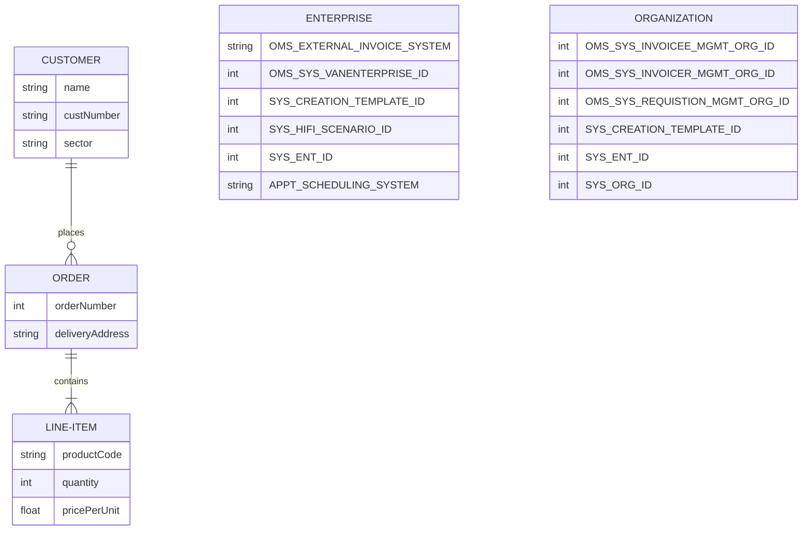

# Documentation for USAID SCCT Project

This page contains various documentation artifacts supporting the USAID SCCT workstreams.  This includes any confluence/wiki pages, etc.  It will also include any automated scripts, etc. used to create/manage documentation.

## ER Diagrams

Using PlantUML/Mermaid ER diagrams can be created and managed using markdown syntax.  See DataDictionary-3.8.xlsx for details on the ER model for the One Network systems. 
The below diagrams are created using [Mermaid ER Diagram](https://mermaid.js.org/syntax/entityRelationshipDiagram.html "Mermaid ER Diagram") syntax.

[TOC levels=2]: # "### Table of contents"

