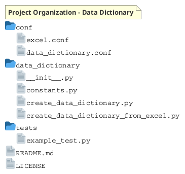
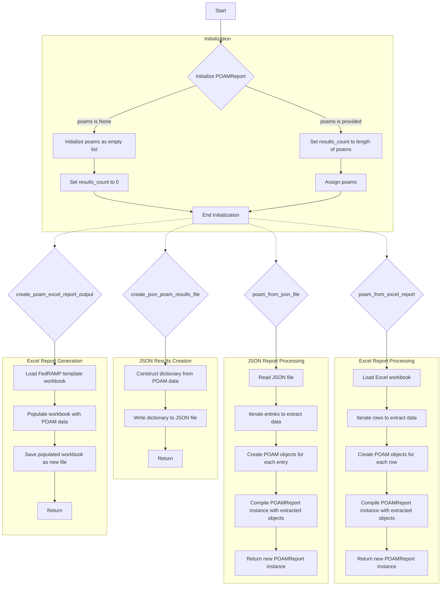
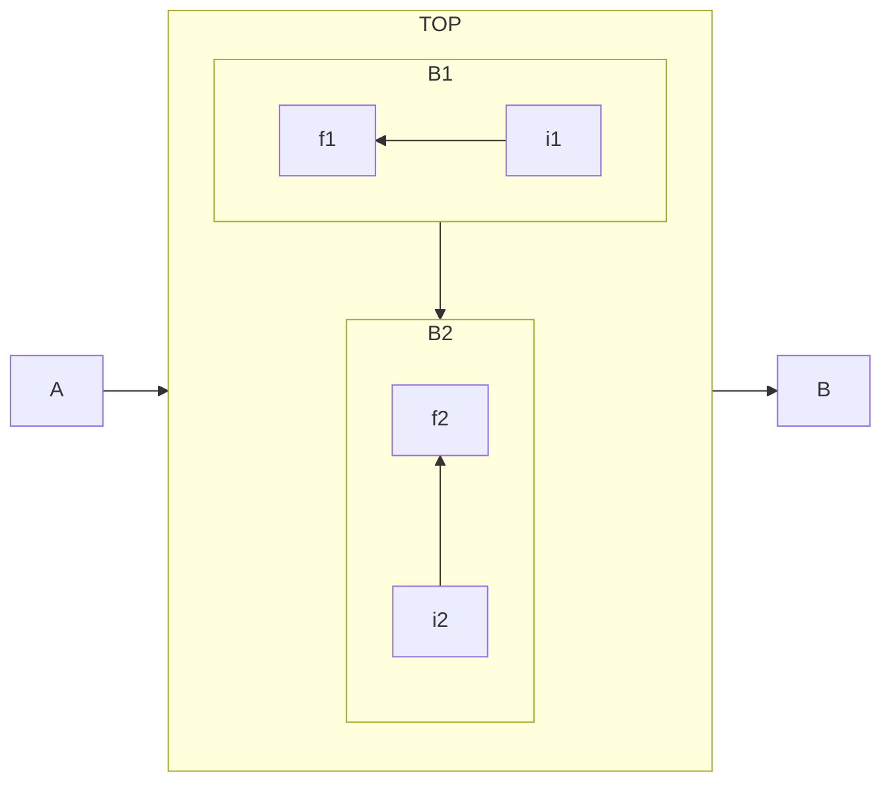
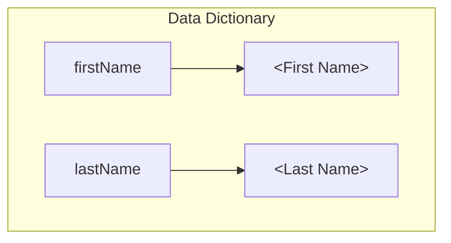
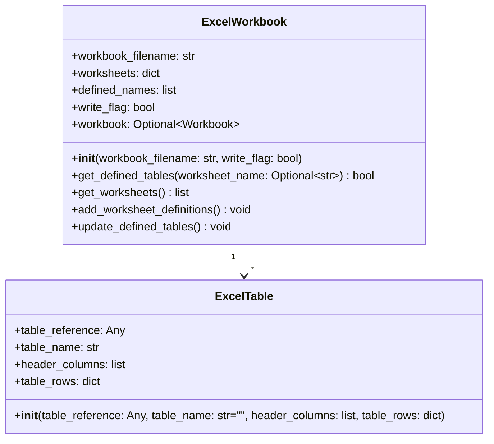
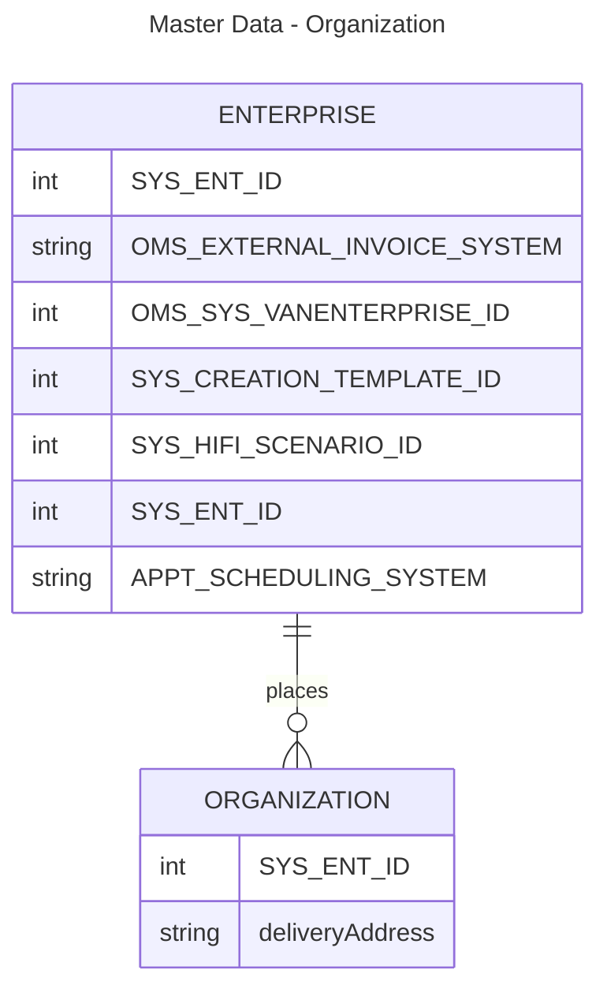
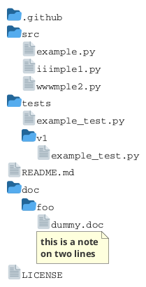

# Data Dictionary

A Data Dictionary data class set of resources and code.

## Process Flow


### Processing an Excel Data Dictionary Template

The below describes the process for reading in an Excel file containing Data Dictionary information and extracting the details to create Data Dictionary related objects (DataDictionary, Entities, Attributes)

The `create_data_dictionary.py` script is designed to create a data dictionary object from an Excel workbook. Here's a breakdown of the script:

<!-- file: C:\Users\DHARTMAN\Documents\Programming\PycharmProjects\Data_Dictionary\data_dictionary\create_data_dictionary.py -->

```python
"""Create a data dictionary object from an Excel Workbook that contains data/details.

This script data from an Excel workbook to create a data dictionary object.

"""

import argparse
import configparser
import os
from excel_workbook.excel_workbook import ExcelWorkbook
from model.DataDictionaryData import DataDictionaryData, EntityData, AttributeData
import logging
import coloredlogs

#: This effectively defines the root of the project and so adding ..\, etc. is not needed in config files
PROJECT_ROOT_DIR = os.path.dirname(os.path.dirname(__file__))

#: Directory that contains configuration files
CONF_DIR = os.path.join(PROJECT_ROOT_DIR, 'conf')

#: Directory were data files/extracts/reports will be stored
DATA_DIR = os.path.join(PROJECT_ROOT_DIR, 'data')

#: Directory were data files/extracts/reports will be stored
EXCEL_FILE_DIR = os.path.join(PROJECT_ROOT_DIR, 'input_files')
```

### Key Parts of the Script:

1. **Imports**: 
   The script imports several modules including `argparse` for handling command-line arguments, `configparser` for reading configuration files, and `os` for operating system interfaces. It also imports an `ExcelWorkbook` class from the `excel_workbook` module, and data classes for the data dictionary model from the `model` package.

2. **Logging**:
   The script uses the `coloredlogs` package to set up logging with a specified format that includes timestamp, filename, and log level.

3. **Project Directories**:
   Several directory paths are defined, such as `PROJECT_ROOT_DIR`, `CONF_DIR`, `DATA_DIR`, and `EXCEL_FILE_DIR`, which are used to manage configuration and data files related to the project.

4. **Main function** (`main`):
   Defined to handle the script processing, reading configuration settings, creating an `ExcelWorkbook` object, and presumably (though not fully implemented here) parsing the data into `DataDictionaryData` and related objects.

The script lays out the foundation for interacting with an Excel workbook to extract and organize data into structured objects representing a data dictionary, though some implementation details, particularly the creation and manipulation of data objects, aren't fully shown in the provided snippet.


## Project Organization

This project is organized as below:



## Data Dictionary Data Structure

```plantuml
@startjson
{
  "DICTIONARY_NAME": "<Name for Data Dictionary>",
  "DESCRIPTION": "<Description for the Data Dictionary>",
  "SUBJECT_AREA": "Subject Area for Dictionary (e.g. OMS, etc.)",
  "ENVIRONMENT": "<Production, Test, QA, etc. if applicable>",
  "ENTITIES": [
       {
         "ENTITY_NAME": "<Name for Entity/Table>",
         "DESCRIPTION": "<Description for the Data Dictionary>",
         "SUBJECT_AREA": "Subject Area for Dictionary (e.g. OMS, etc.)",
         "ENVIRONMENT": "<Production, Test, QA, etc. if applicable>",
         "ATTRIBUTES": [
         [
             {
               "ATTRIBUTE_NAME": "<Name for Attribute/Column>",
               "DESCRIPTION": "<Description for the Data Dictionary>",
               "DATA_TYPE": "<Int, String, etc.>",
               "MAX_LENGTH": "<Int for Max length>",
               "MASK": "<Mask for element, if applicable>",
               "KEYS": ["PK/FK","PK/FK"],
               "PARENT_ENTITY_ATTRIBUTE": [
               {
               "PARENT_ENTITY_NAME": "<Name for Entity/Table>",
               "PARENT_ATTRIBUTE_NAME": "<Parent Attribute/Column Name>"
               },
               {
               "PARENT_ENTITY_NAME": "<Name for Entity/Table>",
               "PARENT_ATTRIBUTE_NAME": "<Description for the Data Dictionary>"
               }
               ]
             },
             {
               "ATTRIBUTE_NAME": "<Name for Attribute/Column>",
               "DESCRIPTION": "<Description for the Data Dictionary>",
               "DATA_TYPE": "<Int, String, etc.>",
               "MAX_LENGTH": "<Int for Max length>",
               "MASK": "<Mask for element, if applicable>",
               "KEYS": ["PK/FK","PK/FK"],
               "PARENT_ENTITY_ATTRIBUTE": [
               {
         "ENTITY_NAME": "<Name for Entity/Table>",
         "DESCRIPTION": "<Description for the Data Dictionary>",
         "SUBJECT_AREA": "Subject Area for Dictionary (e.g. OMS, etc.)",
         "ENVIRONMENT": "<Production, Test, QA, etc. if applicable>"
       },
       {
         "ENTITY_NAME": "<Name for Entity/Table>",
         "DESCRIPTION": "<Description for the Data Dictionary>",
         "SUBJECT_AREA": "Subject Area for Dictionary (e.g. OMS, etc.)",
         "ENVIRONMENT": "<Production, Test, QA, etc. if applicable>"
       }]
             }
          ]  
         ]
       },
       {
         "ENTITY_NAME": "<Name for Entity/Table>",
         "DESCRIPTION": "<Description for the Data Dictionary>",
         "SUBJECT_AREA": "Subject Area for Dictionary (e.g. OMS, etc.)",
         "ENVIRONMENT": "<Production, Test, QA, etc. if applicable>"
       }
    ]  
}
@endjson

```





```@startjson
{
  "Field Name": {
    "0": "Action Name",
    "1": "Creation Org Enterprise Name",
    "2": "Creation Org Name"
  },
  "Field Type": {
    "0": "STRING",
    "1": "STRING",
    "2": "STRING"
  },
  "Model Level": {
    "0": null,
    "1": "SCC.EnhancedOrder",
    "2": "SCC.EnhancedOrder"
  },
  "UI Audit": {
    "0": null,
    "1": null,
    "2": null
  },
  "Required": {
    "0": "Y",
    "1": null,
    "2": null
  },
  "USAID Required": {
    "0": "Y",
    "1": "Y",
    "2": "Y"
  },
  "USAID Model - Regular PO": {
    "0": "OMS.CreateOrUpdateFromInteg",
    "1": "PT2-PSA1",
    "2": "PT2-PSA1"
  },
  "Regular PO": {
    "0": "OMS.CreateOrUpdateFromInteg",
    "1": "PT2-PSA1",
    "2": "PT2-PSA1"
  },
  "Distribution Order": {
    "0": "OMS.CreateOrUpdateFromInteg",
    "1": "PT2-PSA1",
    "2": "PT2-PSA1"
  },
  "Repleneshiment Order": {
    "0": "OMS.CreateOrUpdateFromInteg",
    "1": "PT2-PSA1",
    "2": "PT2-PSA1"
  },
  "Format": {
    "0": "OMS.CreateOrUpdateFromInteg",
    "1": "PT2-PSA1",
    "2": "PT2-PSA1"
  },
  "Max Length": {
    "0": null,
    "1": 128.0,
    "2": 128.0
  },
  "Description": {
    "0": "description 1",
    "1": "description 2",
    "2": "description 2"
  }
}
@endjsonplantuml

```

## Class: ExcelWorkbook

The ExcelWorkbook class encapsulates the operations that can be performed on an Excel workbook, including reading worksheets, listing defined tables within worksheets, and more. It's primarily focused on extracting information rather than modifying or writing new Excel files.

The `ExcelWorkbook` class is designed to facilitate the interaction with Excel spreadsheet files using the OpenPyXL library. Here's a detailed explanation of its purpose and functionality based on the flowchart:

### Purpose
The `ExcelWorkbook` class encapsulates the operations that can be performed on an Excel workbook, including reading worksheets, listing defined tables within worksheets, and more. It's primarily focused on extracting information rather than modifying or writing new Excel files.

### Functionality

1. **Initialization (`__init__`)**
    - **Parameters**: 
      - `workbook_filename`: The path to the Excel file.
      - `write_flag`: A boolean that indicates if the workbook should be opened for writing.
    - **Behavior**:
      - If the file exists and `write_flag` is `False`, it loads the workbook with data only.
      - If the file doesn't exist, it logs an error.
      - If `write_flag` is `True`, it warns that writing is not supported yet.

2. **`get_defined_tables`**
    - **Parameters**: 
      - `worksheet_name`: An optional name of a worksheet.
    - **Behavior**:
      - If no worksheet name is provided, it logs and iterates through all worksheets to print details of each table (displayName, name, type, range, and column names).
      - If a specific worksheet name is provided, it logs and prints the table details specifically for that worksheet.

3. **`get_worksheets`**
    - **Returns**:
      - A list of worksheet titles from the workbook.
    - **Behavior**:
      - Iterates through the workbook's worksheets, appending each worksheet's title to a return list.
      - Adds the worksheet to the dictionary if it doesn't already exist.

4. **`add_worksheet_definitions`**
    - **Behavior**:
      - Iterates through each worksheet in the workbook, adding worksheet titles and table data to the internal dictionary.
      - For each table in a worksheet, it gathers table data for further processing.

5. **`update_defined_tables`**
    - **Behavior**:
      - Logs the gathering of table definitions for all worksheets in the workbook.
      - Iterates through each worksheet and logs the tables being gathered from them.

Overall, the `ExcelWorkbook` class provides a structured way to interact with Excel workbooks for reading and analyzing data, particularly focused on listing worksheets and tables within them. The methods are largely designed for reporting purposes, as the class is currently focused on reading data rather than writing or modifying it.






## Class Definitions

### Class - DataDictionary 

Contains a complete data dictionary including a description as well as an array of Entity class objects. 

#### DataDictionary - Properties

* name (string) - A name for the data dictionary
* description (string) - A description of the data dictionary
* subject_area (string) - The subject area name for the entity (e.g. Master Data, Orders, etc.)
* environment_name (string) - An optional property that describes that environment, business area, business process, application, etc. where the entity is defined. 
* entities (List<Entity>) - An array of Entity objects (See Entity definition below).  A Data Dictionary can be initialized with a set of entities already created.

#### DataDictionary - Methods

* __init__ -> self (class method): Initialize the Data Dictionary class
* add_entity(self, Entity) -> None: Adds a single Entity object to the Data Dictionary
* remove_entity(self, Entity) -> None: Remove an entity from the data dictionary
* get_entity(self, Entity.name) -> Entity: Gets an entity from the Data dictionary

### Class - Entity

A class that defines and logical data model entity or a physical model table along with an array of Attribute objects.

#### Entity - Properties

* entity_name (string) - The name of the entity or table
* entity_description (string) - A description of the entity
* subject_area (string) - The subject area name for the entity (e.g. Master Data, Orders, etc.)
* environment_name (string) - An optional property that describes that environment, business area, business process, application, etc. where the entity is defined. 
* attributes (UserDict<Attribute>) - A dictionary containing Attribute objects (See Attribute definition below) with the attribute name as the key

#### Entity - Methods

* __init__ -> self (@classmethod): Initialize the class
* entity_from_csv -> self (@classmethod): Creates an entity from a csv value
* add_attribute(key, Attribute) -> None: Adds an attribute object
* get_attribute(key) -> Attribute: If key exists, returns the attribute
* remove_attribute(key) -> None: If exists, removes the attribute from the dictionary 

### Class - Attribute

Attribute/Field definition for an Entity based on a UserDict base class

#### Attribute - Properties

* attribute_name (string) - The name of the attribute or column
* format (string) - optional: specific format or mask for the attribute
* attribute_type (string) - The data type of the attribute
* description (string) - A description of the entity

#### Attribute - Methods

* __init__(String attribute_name) -> self (@classmethod): Initialize the class
* add_attribute(key, Attribute) -> None: Adds an attribute object
* get_attribute(key) -> Attribute: If key exists, returns the attribute
* remove_attribute(key) -> None: If exists, removes the attribute from the dictionary 

### ExcelWorkbook

The ExcelWorkbook and ExcelTable classes are designed to facilitate the handling of Excel spreadsheets by simplifying data extraction, manipulation, and interaction tasks. The ExcelWorkbook class represents an Excel workbook and provides functionality to interact with its contents:



Attributes:

workbook_filename: The name of the Excel file.
worksheets: A dictionary to store information about the worksheets in the workbook.
defined_names: A list to hold any defined names within the workbook.
write_flag: A boolean to differentiate between read and write operations.
workbook: An instance of the loaded workbook, or None if not found.
Methods:

__init__: Initializes the workbook, loading it if write_flag is False.
get_defined_tables: Retrieves tables from a specified worksheet or all worksheets.
get_worksheets: Returns a list of worksheet names in the workbook.
add_worksheet_definitions: Adds a definition of each worksheet and its tables to the worksheets dictionary.
update_defined_tables: Updates the list of defined tables in the workbook.
ExcelTable Class
The ExcelTable class represents an Excel table within a worksheet and stores data regarding the table:

Attributes:

table_reference: A reference to the Excel table.
table_name: The name of the table.
header_columns: A list of headers for the table's columns.
table_rows: A dictionary containing the rows of the table.
Methods:

__init__: Initializes the table object with its reference, name, and data.
Interaction
The ExcelWorkbook class uses the ExcelTable class to manage tables within each worksheet. When interacting with a workbook, the ExcelWorkbook methods handle loading and processing of worksheets and tables. For tasks like retrieving table data or updating tables, the ExcelWorkbook may create and manage multiple instances of ExcelTable, using these to represent and manipulate individual tables within the Excel file.

This interaction allows users to handle both the workbook as a whole and its individual tables, providing a structured and organized way to work with Excel data.

```mermaid

```

## To Do Items to Update this Python Template

- [ ] Add directions to README.md to create documentation.
- [ ] Add directions/notes for adding comment headers/blocks
- [ ] Add link/note to wiki page related to commenting Python code.
- [ ] Add Documentation regarding creating/running tests.
- [ ] Add descriptions for folders/files included in template to README.

## Generating/Updating Documentation

1. Running processes to update docs/ folder.
2. Install the sphinx plugin/module.
3. Run the sphinx-quickstart to create the initial structures
4. Update core.py to modify the path to include the project directory and add the sphinx.ext.autodoc to the extensions array.
5. Make updates to the index.rst file to include the Python resources to generate documentation for.


### Code commenting for Documentation

#### Function Header Comment Block

Add the following header to a script/module file.

```python
"""This is the summary line

This is the further elaboration of the docstring. Within this section,
you can elaborate further on details as appropriate for the situation.
Notice that the summary and the elaboration is separated by a blank new
line.
"""
```

See my confluence wiki, [Organizing Python Resources](https://davidhartman.atlassian.net/wiki/spaces/PYTHON/pages/196629) for more details.


#### Class Comment Block


```python
"""
A class used to represent an Animal

...

Attributes
----------
says_str : str
    a formatted string to print out what the animal says
name : str
    the name of the animal
sound : str
    the sound that the animal makes
num_legs : int
    the number of legs the animal has (default 4)

Methods
-------
says(sound=None)
    Prints the animals name and what sound it makes
"""
```




