# Data Dictionary

A Data Dictionary data class set of resources and code.

- [ ] Add details for each script/module/class/config/etc. into this file
    - DataDictionary Classes
    - create_data_dictionary_from_excel script
    - Configuration files
    - DataDictionary exports (JSON, etc.)
- [x] Create function that reads in an existing Data Dictionary JSON file.
- [ ] Create sample data for PSM For Sales Order/Delivery

## Process for Loading Data Dictionary

The below high level steps describe the process for identifying and loading Data Dictionary Data and the process for
generating sample data

1. Identify source of Sales Order Test Data data element definitions
2. Create Data Dictionary containing Sales Order Entity/Attribute definitions
3. Example sample data scenarios
4. Identify all Parent entities defined in the Sales Order definition
5. Sample data generation order
6. Ensuring FK/PK relationships for child entities in sample data
7. Using created markdown/confluence page to extract seed data (e.g. Enterprise) from Confluence page, etc. if
   available.
8. Excel Entity/Attribute definitions should also identify the Process Flows that interact with for each
   Entity/Attribute

### Identify source of Sales Order Test Data data element definitions

See table below for details related to metadata available related to Sales Orders.

| Spreadsheet File                                                          | Worksheet Name                  | Description                                                                           |
|:--------------------------------------------------------------------------|:--------------------------------|:--------------------------------------------------------------------------------------|
| AllUSAIDInterfaces-Release Date -11-15-2024.xlsx                          | HCPT.SalesOrder_IBv1.0          | AllUSAIDInterfaces-Release Date -11-15-2024.xlsx-HCPT.SalesOrder_IBv1.0               |
| AllUSAIDInterfaces-Release Date -11-15-2024.xlsx                          | OMS.SalesOrder_IBv4.0           | AllUSAIDInterfaces-Release Date -11-15-2024.xlsx-OMS.SalesOrder_IBv4.0                |
| SCCT Enterprise Mapping Document 20240813.xlsx                            | Sales Order                     | SCCT Enterprise Mapping Document 20240813.xlsx-Sales Order                            |
| SCCT Enterprise Mapping Document 20240813.xlsx                            | OMS.SalesOrder_IBv4.0           | SCCT Enterprise Mapping Document 20240813.xlsx-OMS.SalesOrder_IBv4.0                  |
| SCCT Enterprise Mapping Document 20240813.xlsx                            | Sales Order for Cust Site PSM   | SCCT Enterprise Mapping Document 20240813.xlsx-Sales Order for Cust Site PSM          |
| SCCT Enterprise Mapping Document 20240813.xlsx                            | Sales Order for Cust Site NG    | SCCT Enterprise Mapping Document 20240813.xlsx-Sales Order for Cust Site NG           |
| SCCT Enterprise Mapping Document 20240813.xlsx                            | Sales Order for RoGI            | SCCT Enterprise Mapping Document 20240813.xlsx-Sales Order for RoGI                   |
| SCCT Enterprise Mapping Document 20240813.xlsx                            | HCPT.SalesOrder_IBv1.0          | SCCT Enterprise Mapping Document 20240813.xlsx-HCPT.SalesOrder_IBv1.0                 |
| SCCT Enterprise Mapping Document 20240813.xlsx                            | RPL.EnhancedBucketizedOrderForB | SCCT Enterprise Mapping Document 20240813.xlsx-RPL.EnhancedBucketizedOrderForB        |
| USAID NextGen SCCT GHSC-PSM Implementing Partner Specifications v1.2.xlsx | Sales Order                     | USAID NextGen SCCT GHSC-PSM Implementing Partner Specifications v1.2.xlsx-Sales Order |

#### Depdendencies

SCC.Organization_IB

### Create Data Dictionary containing Sales Order Entity/Attribute definitions

The [create_data_dictionary_from_excel](./data_dictionary/create_data_dictionary_from_excel.py) script uses the
ENTITIES_SOURCES data structure to create a Data Dictionary containing all entity/attribute definitions for Sales
Orders. Below is the data structure that contains the information needed to identify the Excel file and worksheet
containing Entity/Attribute details to create a Data Dictionary. The script will loop through all entries and create a
Data Dictionary containing the Entity/Attribute details.

```python
ENTITIES_SOURCES = [
    dict(source_file_name=SOURCE_FOLDER / 'AllUSAIDInterfaces-Release Date -11-15-2024.xlsx',
         source_worksheet_name='OMS.SalesOrder_IBv4.0',
         entity_name="OMS_SALES_ORDER",
         subject_area="Transaction: Order Management",
         description="OMS Sales Order entity",
         environment="Data Generation",
         attribute_column_mapping=dict(name="Field Name",
                                       data_type="Field Type",
                                       required="Required",
                                       description="Description",
                                       max_length="Max Length",
                                       mask="Format")
         )
    ,
    dict(source_file_name=SOURCE_FOLDER / 'AllUSAIDInterfaces-Release Date -11-15-2024.xlsx',
         source_worksheet_name='OMS.SalesOrder_IBv4.0',
         entity_name="HCPT_SALES_ORDER",
         subject_area="Transaction: Order Management",
         description="HCPT Sales Order entity",
         environment="Data Generation",
         attribute_column_mapping=dict(name="Field Name",
                                       data_type="Field Type",
                                       required="Required",
                                       description="Description",
                                       max_length="Max Length",
                                       mask="Format")
         )
]
```

```json
{
  "DATA_DICTIONARY_SOURCES": [
    {
      "source_file_name": "<Excel File Path>",
      "source_worksheet_name": "<Excel Worksheet>",
      "entity_name": "<Entity Name>",
      "subject_area": "<Subject Area>",
      "environment": "<Dev, Test, Prod, Data Generation, etc.>",
      "keys": "<PK, FK, etc.>",
      "attribute_column_mapping": {
        "name": "<Field Name>",
        "data_type": "<Field Type?",
        "required": "Y/N",
        "description": "<Description>",
        "max_length": "<Max Length>",
        "mask": "<Format/Mask>"
      }
    },
    {
      "source_file_name": "<Excel File Path>",
      "source_worksheet_name": "<Excel Worksheet>",
      "entity_name": "<Entity Name 2>",
      "subject_area": "<Subject Area>",
      "environment": "<Dev, Test, Prod, Data Generation, etc.>",
      "keys": "<PK, FK, etc.>",
      "attribute_column_mapping": {
        "name": "<Field Name>",
        "data_type": "<Field Type?",
        "required": "Y/N",
        "description": "<Description>",
        "max_length": "<Max Length>",
        "mask": "<Format/Mask>"
      }
    }
  ]
} 
```

Each entry identifies an Excel File and worksheet that contains Entity/Attribute details. This also includes a mapping
data structure that identifies which Excel columns map to the DataDictionary Entity and Attribute class definitions.

[//]: # (TODO: Create function that can print markdown text that can be pasted into documentation.  E.g. a table that lists the spreadsheet files, tabs, etc. that is built from the data structure created in the script above.)

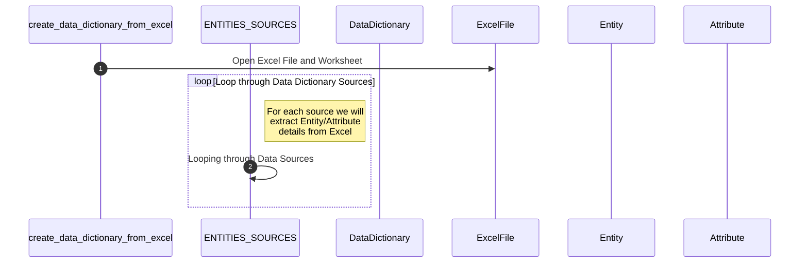

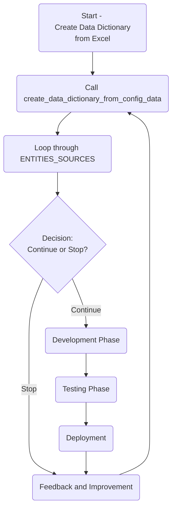

### Create Relationship/Constraint mappings

While lopping through each Entity and extracting attribute details, store relationship/constraint details for later processing.  
The data structure for storing this information is described below.

- Each Entity will have a dictionary entry that is an array of relationships/constraints.

A constraint will include the following details:

entity=<Entity from DataDictionary Entry>
constraints = [<An Array of constraint definitions>]

A constraint entry includes the following details:
* **constraint_name**: A Name for the constraint
* **constraint_type**: The type of constraint.  E.g. Foreign Key/Primary Key
* **parent_entity**: Parent Entity Name.  This will be validated by checking if Entity exists in DataDictionary
* **parent_attribute**: Attribute in Parent Entity.  For a FK/PK constraint, this will be the primary key field of the parent entity.  This will be validated by checking if Entity exists in DataDictionary
* **parent_return_attribute**: The Attribute from the Parent Entity that becomes the value for the child entities attribute
* **parent_join_criteria**: The logic for how the child and parent entities are constrained. This will generally be the join criteria used to perform lookup into the parent entity
* **parent_filter_criteria**: Additional criteria/logic that is to be applied determining the unique value to be returned from a Parent entity lookup.  E.g. Only consider parent entity values that are marked as "active"

A constraint example is described below:

```python
ENTITY_CONSTRAINTS = dict(entity_name="<Entity Name>",
                          constraints=[])

```

```python
ENTITY_CONSTRAINTS = [
    dict(source_file_name=SOURCE_FOLDER / 'AllUSAIDInterfaces-Release Date -11-15-2024.xlsx',
         source_worksheet_name='OMS.SalesOrder_IBv4.0',
         entity_name="OMS_SALES_ORDER",
         subject_area="Transaction: Order Management",
         description="OMS Sales Order entity",
         environment="Data Generation",
         attribute_column_mapping=dict(name="Field Name",
                                       data_type="Field Type",
                                       required="Required",
                                       description="Description",
                                       max_length="Max Length",
                                       mask="Format")
         )
    ,
    dict(source_file_name=SOURCE_FOLDER / 'AllUSAIDInterfaces-Release Date -11-15-2024.xlsx',
         source_worksheet_name='OMS.SalesOrder_IBv4.0',
         entity_name="HCPT_SALES_ORDER",
         subject_area="Transaction: Order Management",
         description="HCPT Sales Order entity",
         environment="Data Generation",
         attribute_column_mapping=dict(name="Field Name",
                                       data_type="Field Type",
                                       required="Required",
                                       description="Description",
                                       max_length="Max Length",
                                       mask="Format")
         )
]
```


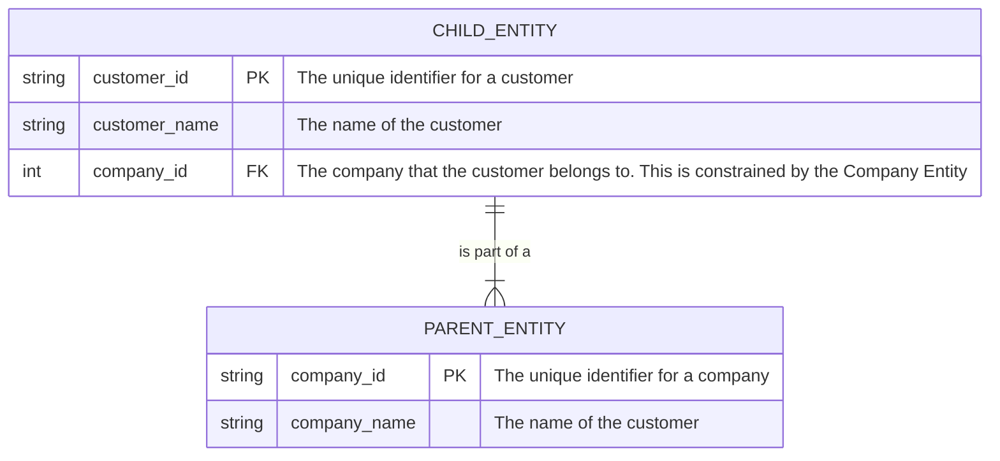

With the above processes, the goal would be to produce a diagram with the appropriate links/RI.

Entity with complete set of attributes, keys, etc. RI between parent and child.

### Example sample data scenarios

### Identify all Parent entities defined in the Sales Order definition

### Sample data generation order

### Ensuring FK/PK relationships for child entities in sample data

#### Enterprise/Org/Site Hierarchy - Entity Relationship Diagram

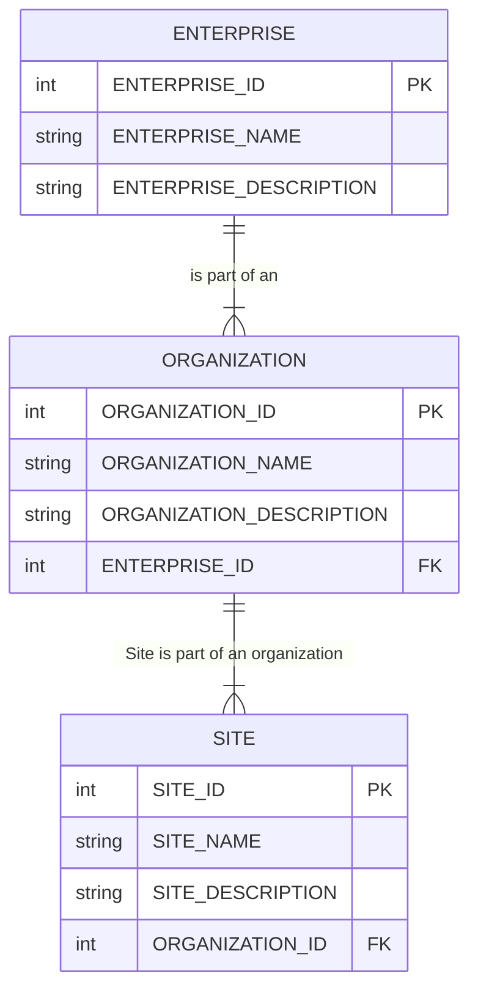


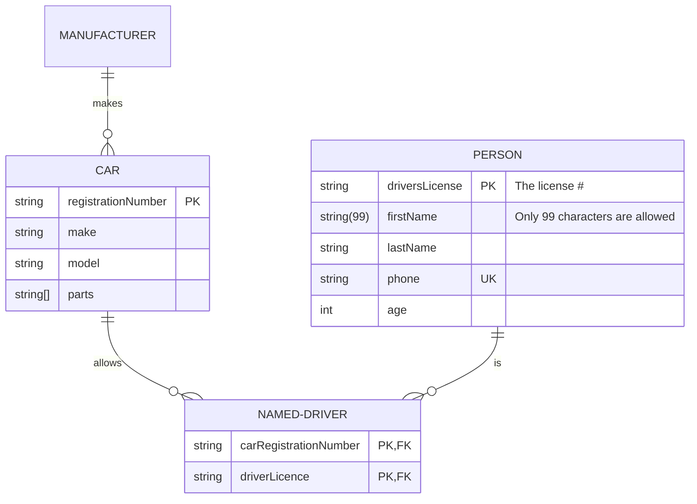

### Using created markdown/confluence page to extract seed data (e.g. Enterprise) from Confluence page, etc. if available.

### Excel Entity/Attribute definitions should also identify the Process Flows that interact with for each Entity/Attribute

## Current Processes

Here's an explanation of each step in the flowchart for the `create_data_dictionary_from_excel.py` script:

1. **Start Script**: This is the entry point of the script where execution begins.
2. **Process Command Line Arguments**: The script processes any command line arguments provided by the user to customize
   the behavior or input/output of the script.
3. **Get Config Details from conf/data_dictionary.conf**: This step involves reading configuration details from a
   specified configuration file, which likely contains settings or parameters for the script's execution.
4. **Create DataDictionary Instance**: An instance of the `DataDictionary` class is created, which will be used to store
   and manage the parsed data.
5. **Read Excel Workbook**: The script reads an Excel workbook from the provided file input. This workbook contains the
   data needed to build the data dictionary.
6. **Create Panda DataFrame for Worksheet**: A Pandas DataFrame is created for a specific worksheet within the Excel
   file to simplify the data manipulation and extraction process.
7. **Create Entity from Worksheet Name**: An entity is created based on the worksheet name. The worksheet's name serves
   as an identifier or category for the data being extracted.
8. **Iterate Over DataFrame Rows**: The script iterates over each row in the DataFrame to process the data row-by-row.
9. **Row contains valid data?**: This decision point checks if the current row contains valid data that can be processed
   further.
10. **Create Attribute from Row**: If the row contains valid data, an attribute is created from the information in the
    row for association with an entity.
11. **Add Attribute to Entity**: The created attribute is added to the corresponding entity, effectively organizing data
    within the entity.
12. **Skip Row**: If the row does not contain valid data, it is skipped and not processed further.
13. **Add Entity to DataDictionary**: After all attributes are processed for the current worksheet, the entity is added
    to the `DataDictionary`, building a structured dataset.
14. **Write DataDictionary to JSON**: The complete `DataDictionary` object is written to a JSON file, allowing easy
    access and export of the structured data.
15. **End Script**: This marks the end of the script execution, concluding the process flow and outputting the results.

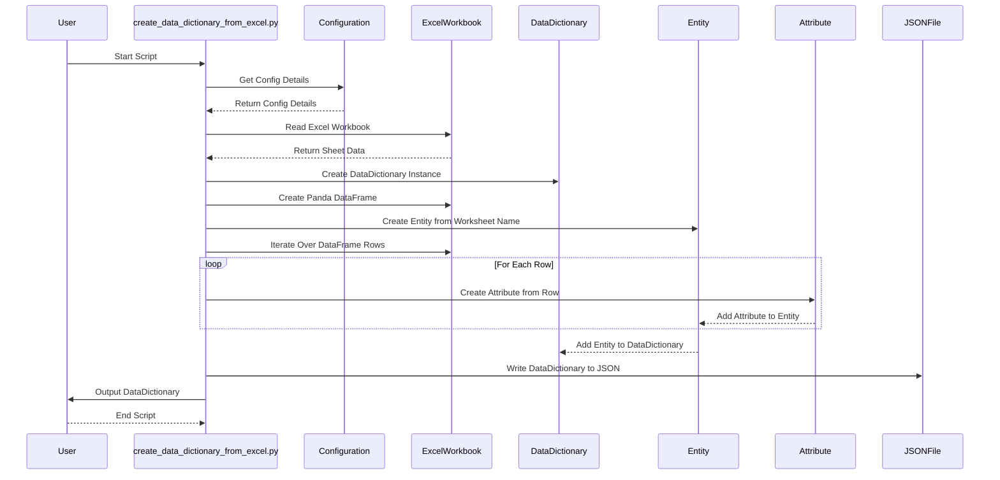

<!--
https://www.plantuml.com/plantuml/png/xPbHazes4CVV-HHRdY_C7KsRz9xYWCAv2OOQqIaj6O_EB5Z1I8maSg6TVFTwmoL6LmzZsfjS4_9cx_vbv9-atR-7PzO9uzvOhHhVkGnN2DUvI9UFbaekCjVugm7Gx8OT7WwY89uaKT1dpKjeZaT1s4swmecaArCdjH9csppxe6QZJXmEQSGd9P0IIYNCjO61GeZGtMYp1Bkr3bSj09v92mwjWnaDIRLoGYeBtmCg9vr42pVIPM3nBHgHWt3EoEkDA-8eqgnrEuU0iwJ78XON5rsQHlky_VZHHVlHnK_yl7rv_kIo_KEh_RJz-CcFkn4i-ZMC1r6VHPpaGPxlugF1EEwmv4NuYesAn1z5h8XsBgVJiKLZfzFkLH3pVX0LLphTh52v8ZWqUc74QYNLehZPffamgoBs1bFAti4sdKgrthXaBdCiickTMB5QvzXwbzjtpGR0wziPyf27UxEWjG7uc9aa8RqetR1u68SZrZpp1ENYLKdkh1fJ3itQI8ixxjiMGA1WBqpBb24ulOOSts8EUau169Y5KF9FGIy7LnADC6csBNzeD7x-C-lm98XPGB_K5zQX0M9IYkwi1YMXXmgDeCUMke3pE7m-vdjKziducdy0ei1PjTH7vOkhYGLWDyReXN08IzmMB8G3EIDwSzgrGitsy7cFgi6a7XT_VW4F4ZuPCbA64VUp_U2tv1MBUlogIAjDddlPcFqo3kFToPdu0r-ooGVOpU7BvkjFYVTdHyCdnFNn-_Ag1U0PWX8hlDs83mXxnECmwXtWVT5-sZe_5hW7koxaVKRrMVkZ3YEVeKsDN1EIZ-JB9trXvACQvEjiyrt_wSICkiyXxeUrFct2W7TsDjm82wd18ZFxtAnftl--ffH8Rwy8CW4-qDe6SI-8mjy30bBPt2f4rIYz9bNTu4hhSG7Qm4eRlxVPrl-XfrMGgT7LFFazz3Mzn-LKEvl7b40VjGZ7TZSF-TVNtnxOoSsrGRbGvNxFfLfQS1h4VeaulcJG02y4rvXhjQ1dWrQuEqqgtzBDrsKNN_pNGrNNozGOLylDVAQJzitFU0UYlgFXHYWhKXfq2GCpGmDzeSG2wHlyY_Kuev1NVxXxoUgoDP8EzmkAK3vQAYu6rmOjAcT1m3hRMfcA77ATUYWUrDAK86gKTPBTXuKXTgTcNJpK1BGExEEj2g4zLOj2nEetBbz_RCFoU9zeexhV3w7wjj2lj1K-hy8QqZhPqtDsz-yelZcA1bszRpn3DQE_Slu6
-->
<!--

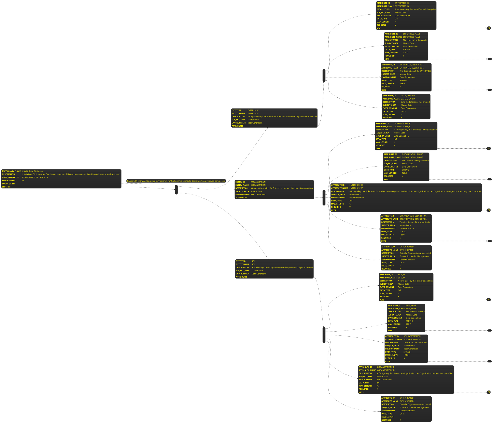
-->

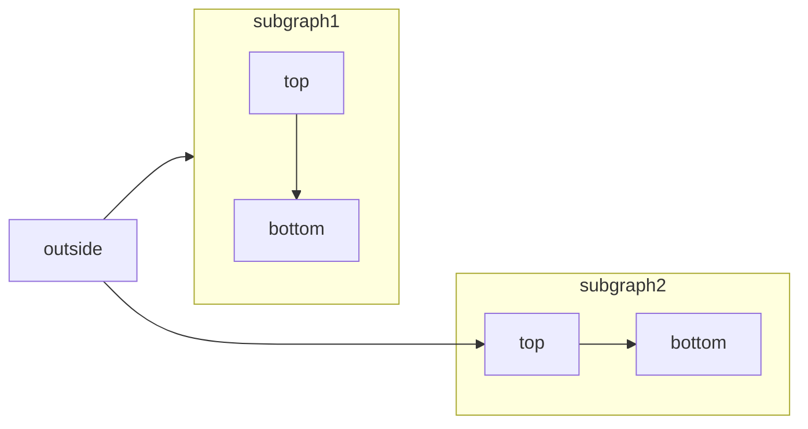

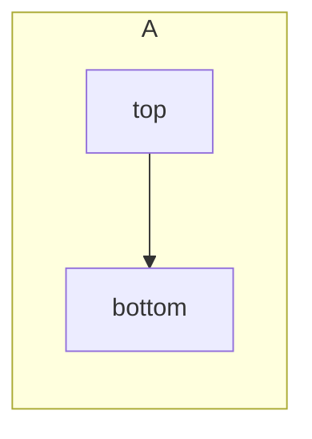

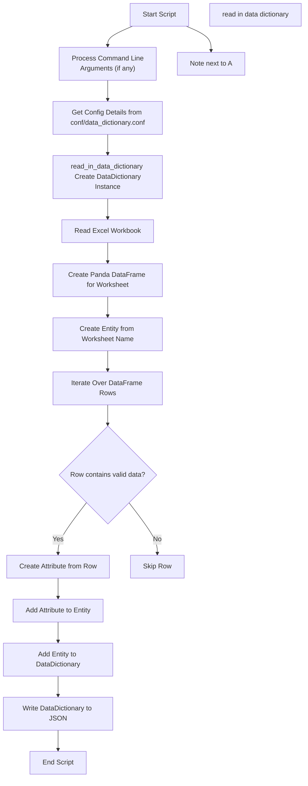


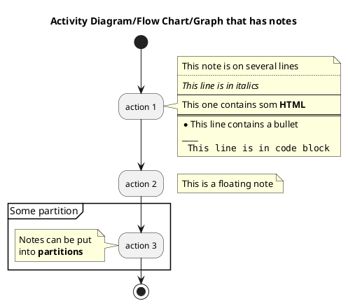

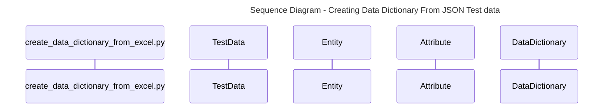

```
sequenceDiagram
    autonumber
    participant Script as create_data_dictionary_from_excel.py
    participant TestData as TestData
    participant ExcelWorkbook as ExcelWorkbook
    participant DataDictionary as DataDictionary

    Script-->ExcelWorkbook: Create ExcelWorkbook instance
    Script-->ExcelWorkbook: Read Excel file
    ExcelWorkbook-->>Script: Return sheet data

    Script->>DataDictionary: Create DataDictionary instance
    Script->>DataDictionary: Parse data into EntityData and AttributeData
    DataDictionary-->>Script: Return DataDictionary object
```

To create a flowchart for the `create_data_dictionary_from_excel.py` script, we need to outline the main steps and
processes involved in the script. Based on the provided sequence diagram and script details, here's a flowchart
representation:

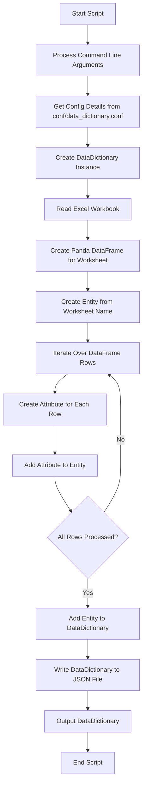

### Explanation:

- **Start Script**: The script begins execution.
- **Process Command Line Arguments**: The script processes any command line arguments provided.
- **Get Config Details**: Configuration details are fetched from the `conf/data_dictionary.conf` file.
- **Create DataDictionary Instance**: A new instance of `DataDictionary` is created.
- **Read Excel Workbook**: The Excel workbook is read to extract data.
- **Create Panda DataFrame for Worksheet**: A DataFrame is created for the worksheet specified in the config file.
- **Create Entity from Worksheet Name**: An entity is created based on the worksheet's name.
- **Iterate Over DataFrame Rows**: The script iterates over each row in the DataFrame.
- **Create Attribute for Each Row**: For each row, an attribute is created.
- **Add Attribute to Entity**: The created attribute is added to the entity.
- **All Rows Processed?**: A check to see if all rows have been processed.
    - If **Yes**, proceed to add the entity to the DataDictionary.
    - If **No**, continue iterating over the rows.
- **Add Entity to DataDictionary**: The entity is added to the DataDictionary.
- **Write DataDictionary to JSON File**: The DataDictionary is written to a JSON file.
- **Output DataDictionary**: The final DataDictionary is outputted.
- **End Script**: The script ends.

This flowchart provides a high-level overview of the script's process flow. If you need further details or
modifications, feel free to ask!

## Use Cases/Stories/Epics/Key Processes

1. Load existing data dictionary (generated from previous executions) information from JSON file into Data Dictionary
   objects (DataDictionary, Entity, Attribute)
2. A technical process that imports an Excel spreadsheet that contains data dictionary information.
    * Each worksheet contains 1 Entities Definition
    * Creates Entity and for each row creates an Attribute
    * Imports/Uses
        * DataDictionary
        * Entity
        * Attribute
3. Export existing data dictionary objects to JSON formatted file.
    * JSON Format
    * output_files/data_dictionary.json
4. Maintain an external source (Excel, JSON, CSV, etc.) for the data dictionary that is imported as needed to add/update
   information from previous executions.
5. Capture configuration details needed to ingest Excel spreadsheets containing data dictionary elements
    * JSON Format
    * data_dictionary_config.json
6. Generate various output formats of a data dictionary (e.g. Markdown, Excel, Document, diagrams, etc.)
    * Take DataDictionary instance and export it's Entities and Attributes to various formats
    * Create a set of linked pages that include data dictionary details. This includes markdown pages. These can be
      imported or otherwise used to make a data dictionary available to users.
        * Markdown
        * Excel
        * JSON
        * CSV
7. Identify and Store data model relationships (ER Parent/Child, etc.)
8. Generate Data Lineage/Traceability mapping

### 1. Load existing data dictionary (generated from previous executions) information from JSON file into Data Dictionary objects (DataDictionary, Entity, Attribute)

If a data dictionary has been previously processed and saved into a JSON formatted file, this should be loaded prior to
processing subsequent data dictionary entries.

### 2. A technical process that imports an Excel spreadsheet that contains data dictionary information.

* Each worksheet contains 1 Entities Definition
* Creates Entity and for each row creates an Attribute
* Imports/Uses
* DataDictionary
* Entity
* Attribute

### Export complete existing data dictionary objects to JSON formatted file.

Take an existing data dictionary and export the data into a formatted file (JSON, Markdown, etc.). This file can be used
by other processes as needed and also loaded in subsequent processing steps.

JSON Format
output_files/data_dictionary.json

### Maintain an external source (Excel, JSON, CSV, etc.) for the data dictionary that is imported as needed to add/update information from previous executions.

Export to Json

### Capture configuration details needed to ingest Excel spreadsheets containing data dictionary elements

* JSON Format
* data_dictionary_config.json

### Generate various output formats of a data dictionary (e.g. Markdown, Excel, Document, diagrams, etc.)

* Take DataDictionary instance and export it's Entities and Attributes to various formats
* Create a set of linked pages that include data dictionary details. This includes markdown pages. These can be imported
  or otherwise used to make a data dictionary available to users.
    * Markdown
    * Excel
    * JSON
    * CSV

### Identify and Store data model relationships (ER Parent/Child, etc.)

Parent/Child, Foreign Keys, etc.

### Generate Data Lineage/Traceability mapping

Create diagrams showing traceability.

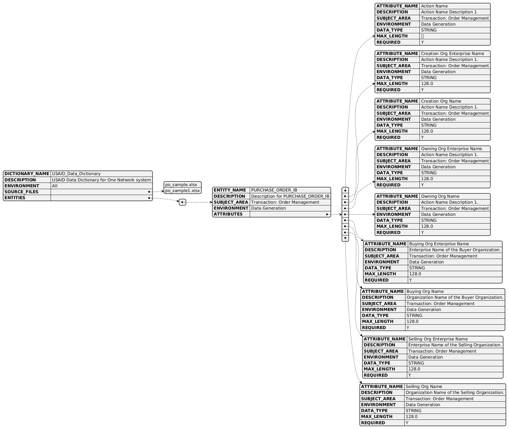

## Scripts/Modules

### create_data_dictionary_from_excel.py

This script creates a DataDictionary object with a Excel spreadsheet identified that contains Entity and Attribute
definitions.

1. Create DataDictionary from Excel Workbook
2. Create panda DataFrame for Worksheet defined in config file that contains Entity/Attribute details
3. Create an Entity based on the Worksheet name.
4. For each row in the DataFrame create an Attribute and add it to the Entity
5. Once all attributes are added to the entity, add the entity to the DataDictionary.
6. Write a DataDictionary object to a JSON formatted file.

* main(): Main processing of script
* read_excel_table(sheet, table)
* get_all_tables()
* process_args() - Process command line arguments and save to variables.
* get_configs() - Gets config details from conf/data_dictionary.conf configuration file in .ini file format

### Sequence Diagram

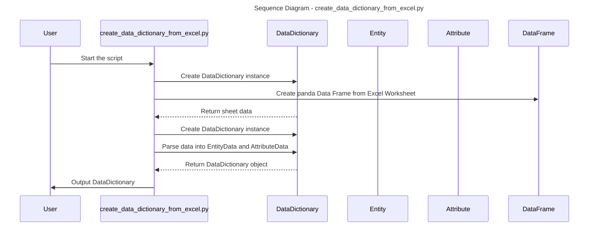

## Project Organization

This project is organized as below:

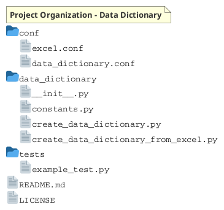

## Class Definitions

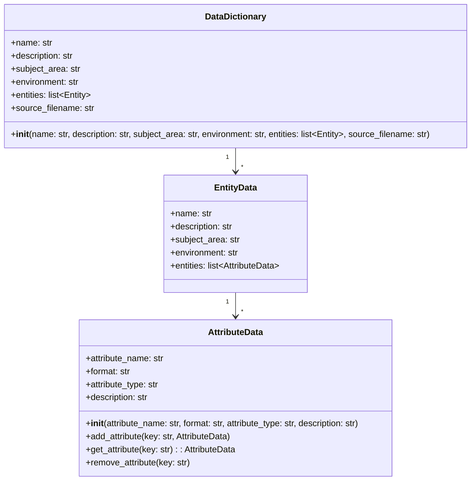

### Class - DataDictionary

Contains a complete data dictionary including a description as well as an array of Entity class objects.
[plantUML for All Classes](https://www.plantuml.com/plantuml/png/bLN1RkCs4BthAmQwRDecRXVeIMYBJMDl4Q2nWzWz56r1CEBOvbeYLNAKr5ZatqkDADFMnjkj3n4uV6z8llV8lFCa7RLrbP5jW2myMY9RWz8EIzBMP7wdJIEThA7I1cdV85X7MvjbZIntSeCmdOgRnNovkfwlbY0zv5D94gQQ-TBjuSOQJzAGpm4-PX1-nX9sqFbR7WACAUL0YVEjHmLhww1njaJljTdm31h5pJ8UbPNq7cRprUtgThOKoyLl3pUpPLnpCe5xPnjqfD67KUpiRUjA56jTeJ2onW9-w4jXkKgX--aKzspTpcyHAOBVBEwMawMiq2zSG8lRdv--dtpt9fBGaAPzXEO1AfRNluQTBHwciuTywDm-Vi2IX7Ge0shbfF6IbIY0cyATD47e6WqD78M-TBfX43S6taF4zyiEM3HFsbdJqOjepYzeqCcEdG_QB7WJHy988gSVMq9HsggjZQXbqmJT2_ZZtDHVJ7r9Nfnj0X_FhXjDk1wOy5vZfM0UoeCNIf8K8OgluLQXFE0S_jrgXoeS-_TlvwzezwLor_8VKQ7PqFQisWdgT-TaPcK-pMV-DeUlhwuWhwNPvvyH_jevkGUxXZzDGa6SzjbB5dwagKA-JyStaCsOQhbniivwQv9mqeUbhS9gSagR720v-zNPTNFA7NpxPfHYJmwuVfg-LDxXdXtqnqMsFesJpoV5P5ygNu58iXtQC26bWD4_XYpaF16jIfsFNTQ6uEJ8TqXRguRp2g6D9Y4klYeOHbQeeDk5nseTIsa_QsVhVhgi_6MQu5e1tT-EyvBni-ZqPal1v2HoKUJ_hrcUhRRQG-bGTXP9as1PnmS9z_jm70CgPSIoVrbwKJaceoITpSfe60Dp6efi_1XbwOaiRNjIqUZxKNgVOoMc91lVPBQ54vCE9Hnkj2Utv-cnQr6WCQcN-8EtffTuF7sqemBk9Mq7mvKwdkCiNCBdqFtP8x0V533ZRqGzE_tf1YF1jiHjEprIwtIiMhgTii-crowI3iN0Ra83fLtFlOIrxJPgdz3ngWKyMbk5-_9ULXvZQ-q5rWtjEzv5avRS88d1DrvfL1-TCbtHY1F2anFYG7s9yOjgd8yTptzvtD95E4vStABGwhyIblX-5Aap1-6tWSF4fRFFHHHcVBrZDTtj4JebDQ6vq6r3cmrhd1AN7ibens5SfEVcTUjIDQbrPDUfBVplhBScumzNqXBPEpIghQj_0G00)

```plantuml
class DataDictionary as "model.DataDictionary.DataDictionary" {
   + str : subject_area: 
   + str : environment: 
   + str : entity_count: 
   + List[Entity] : entities: 
   + List[str] : source_files: 
   + str : name: 
   + str : description: 
   ..
   -_data_dictionary_registry: 
   ..
   __init__() : DataDictionary
   {static} create_data_dictionary_from_json(cls, data_dictionary_source_file: Path) 
   + add_source_file(self, source_file: Path) 
   + add_entity(self, entity: Entity): 
   + write_data_dictionary(self, out_filename: Path): 
   + create_markdown_files(self, markdown_output_dir: Path, force_overwrite: bool = False): 
   - is_empty_dir(path): 
   + get_entities(self): 
   + get_entity(self, entity_name: str): 
   # __str__(self): 
}
```

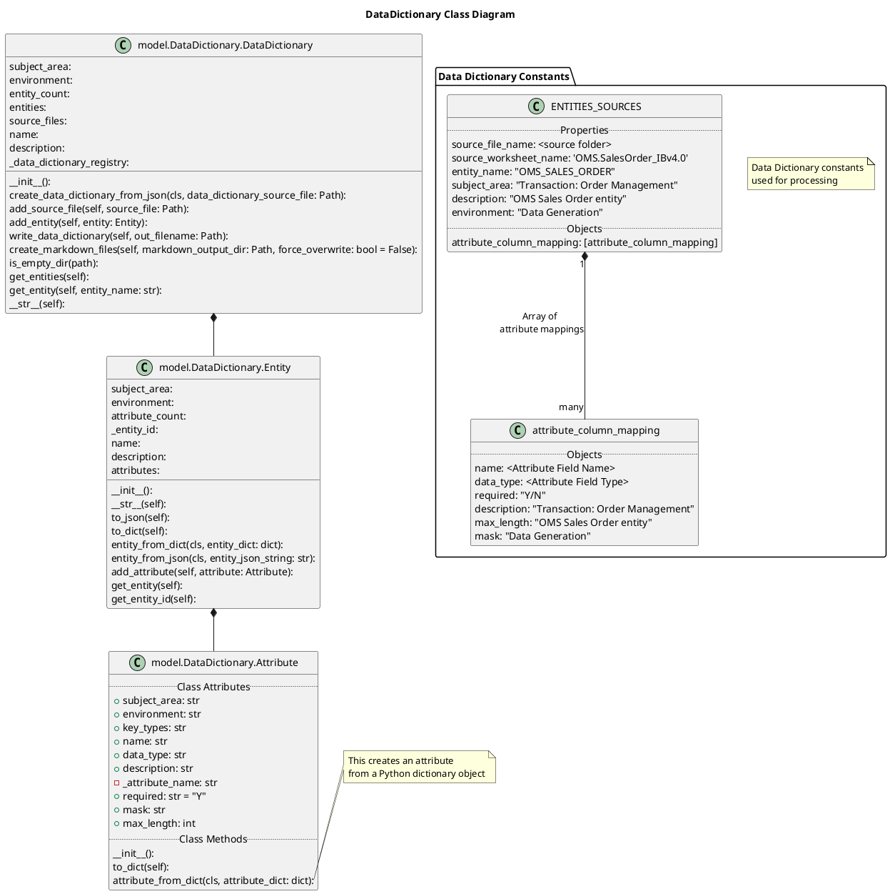

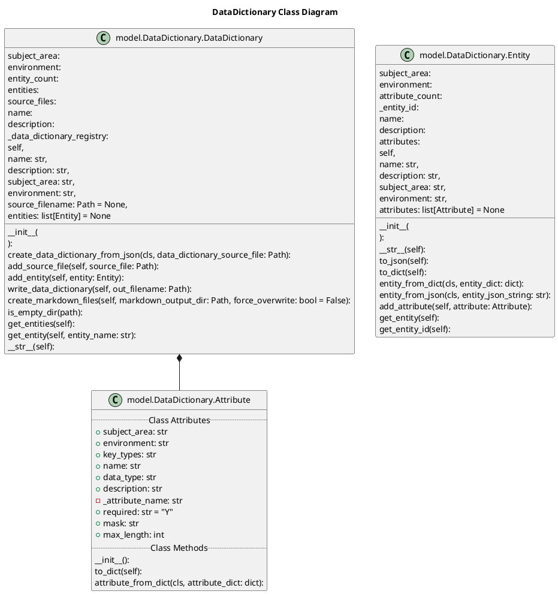

```plantuml
@startjson
{
  "DICTIONARY_NAME": "<Name for Data Dictionary>",
  "DESCRIPTION": "<Description for the Data Dictionary>",
  "SUBJECT_AREA": "Subject Area for Dictionary (e.g. OMS, etc.)",
  "ENVIRONMENT": "<Production, Test, QA, etc. if applicable>",
  "ENTITIES": [
       {
         "ENTITY_NAME": "<Name for Entity/Table>",
         "DESCRIPTION": "<Description for the Data Dictionary>",
         "SUBJECT_AREA": "Subject Area for Dictionary (e.g. OMS, etc.)",
         "ENVIRONMENT": "<Production, Test, QA, etc. if applicable>",
         "ATTRIBUTES": [
             {
               "ATTRIBUTE_NAME": "<Name for Attribute/Column>",
               "DESCRIPTION": "<Description for the Data Dictionary>",
               "DATA_TYPE": "<Int, String, etc.>",
               "MAX_LENGTH": "<Int for Max length>",
               "MASK": "<Mask for element, if applicable>",
               "KEYS": ["PK/FK","PK/FK"],
               "PARENT_ENTITY": <Parent Entity>,
               "PARENT_ATTRIBUTE": <Parent Attribute>,
               "PARENT_RETURN_ATTRIBUTE": <Parent Attribute to be Returned>,
               "JOIN_CRITERIA": <Join Criteria (if any) used when looking up Parent return Attribute)>,
               "FILTER_CRITERIA": <Any filter criteria used when lookup up Parent return Attribute>
             },
             {
               "ATTRIBUTE_NAME": "<Name for Attribute/Column>",
               "DESCRIPTION": "<Description for the Data Dictionary>",
               "DATA_TYPE": "<Int, String, etc.>",
               "MAX_LENGTH": "<Int for Max length>",
               "MASK": "<Mask for element, if applicable>",
               "KEYS": ["PK/FK","PK/FK"],
               "PARENT_ENTITY": <Parent Entity>,
               "PARENT_ATTRIBUTE": <Parent Attribute>,
               "PARENT_RETURN_ATTRIBUTE": <Parent Attribute to be Returned>,
               "JOIN_CRITERIA": <Join Criteria (if any) used when looking up Parent return Attribute)>,
               "FILTER_CRITERIA": <Any filter criteria used when lookup up Parent return Attribute>
             }
         ]
       },
       {
         "ENTITY_NAME": "<Name for Entity/Table>",
         "DESCRIPTION": "<Description for the Data Dictionary>",
         "SUBJECT_AREA": "Subject Area for Dictionary (e.g. OMS, etc.)",
         "ENVIRONMENT": "<Production, Test, QA, etc. if applicable>",
         "ATTRIBUTES": [
             {
               "ATTRIBUTE_NAME": "<Name for Attribute/Column>",
               "DESCRIPTION": "<Description for the Data Dictionary>",
               "DATA_TYPE": "<Int, String, etc.>",
               "MAX_LENGTH": "<Int for Max length>",
               "MASK": "<Mask for element, if applicable>",
               "KEYS": ["PK/FK","PK/FK"],
               "PARENT_ENTITY": <Parent Entity>,
               "PARENT_ATTRIBUTE": <Parent Attribute>,
               "PARENT_RETURN_ATTRIBUTE": <Parent Attribute to be Returned>,
               "JOIN_CRITERIA": <Join Criteria (if any) used when looking up Parent return Attribute)>,
               "FILTER_CRITERIA": <Any filter criteria used when lookup up Parent return Attribute>
             },
             {
               "ATTRIBUTE_NAME": "<Name for Attribute/Column>",
               "DESCRIPTION": "<Description for the Data Dictionary>",
               "DATA_TYPE": "<Int, String, etc.>",
               "MAX_LENGTH": "<Int for Max length>",
               "MASK": "<Mask for element, if applicable>",
               "KEYS": ["PK/FK","PK/FK"],
               "PARENT_ENTITY": <Parent Entity>,
               "PARENT_ATTRIBUTE": <Parent Attribute>,
               "PARENT_RETURN_ATTRIBUTE": <Parent Attribute to be Returned>,
               "JOIN_CRITERIA": <Join Criteria (if any) used when looking up Parent return Attribute)>,
               "FILTER_CRITERIA": <Any filter criteria used when lookup up Parent return Attribute>
             }
         ]
       }
}
@endjson

```

#### DataDictionary - Properties

* name (string) - A name for the data dictionary
* description (string) - A description of the data dictionary
* subject_area (string) - The subject area name for the entity (e.g. Master Data, Orders, etc.)
* environment_name (string) - An optional property that describes that environment, business area, business process,
  application, etc. where the entity is defined.
* entities (list(Entity)) - An array of Entity objects (See Entity definition below). A Data Dictionary can be
  initialized with a set of entities already created.

#### DataDictionary - Methods

* __init__ -> self (class method): Initialize the Data Dictionary class
* add_entity(self, Entity) -> None: Adds a single Entity object to the Data Dictionary
* remove_entity(self, Entity) -> None: Remove an entity from the data dictionary
* get_entity(self, Entity.name) -> Entity: Gets an entity from the Data dictionary
* write_data_dictionary(self): This method is intended to write the data dictionary's content to an output file. The
  out_filename parameter specifies the path where the file should be saved. The specific details about how the data is
  formatted and written are defined within the method.
* create_data_dictionary_from_json(data_dictionary_source_file: Path): Creates an instance of a DataDictionary object from a JSON file.  

### Class - Entity

A class that defines and logical data model entity or a physical model table along with an array of Attribute objects.

#### Entity - Properties

* entity_name (string) - The name of the entity or table
* entity_description (string) - A description of the entity
* subject_area (string) - The subject area name for the entity (e.g. Master Data, Orders, etc.)
* environment_name (string) - An optional property that describes that environment, business area, business process,
  application, etc. where the entity is defined.
* attributes (UserDict<Attribute>) - A dictionary containing Attribute objects (See Attribute definition below) with the
  attribute name as the key

#### Entity - Methods

* __init__ -> self (@classmethod): Initialize the class
* entity_from_csv -> self (@classmethod): Creates an entity from a csv value
* add_attribute(key, Attribute) -> None: Adds an attribute object
* get_attribute(key) -> Attribute: If key exists, returns the attribute
* remove_attribute(key) -> None: If exists, removes the attribute from the dictionary

### Class - Attribute

Attribute/Field definition for an Entity based on a UserDict base class

#### Attribute - Properties

* attribute_name (string) - The name of the attribute or column
* format (string) - optional: specific format or mask for the attribute
* attribute_type (string) - The data type of the attribute
* description (string) - A description of the entity

#### Attribute - Methods

* __init__(String attribute_name) -> self (@classmethod): Initialize the class
* add_attribute(key, Attribute) -> None: Adds an attribute object
* get_attribute(key) -> Attribute: If key exists, returns the attribute
* remove_attribute(key) -> None: If exists, removes the attribute from the dictionary

### Class - ExcelWorkbook

The ExcelWorkbook class encapsulates the operations that can be performed on an Excel workbook, including reading
worksheets, listing defined tables within worksheets, and more. It's primarily focused on extracting information rather
than modifying or writing new Excel files.

The `ExcelWorkbook` class is designed to facilitate the interaction with Excel spreadsheet files using the OpenPyXL
library. Here's a detailed explanation of its purpose and functionality based on the flowchart:

The ExcelWorkbook and ExcelTable classes are designed to facilitate the handling of Excel spreadsheets by simplifying
data extraction, manipulation, and interaction tasks. The ExcelWorkbook class represents an Excel workbook and provides
functionality to interact with its contents:

```mermaid
classDiagram
    direction TB
    class ExcelWorkbook {
        +workbook_filename: str
        +worksheets: dict
        +defined_names: list
        +write_flag: bool
        +workbook: Optional~Workbook~
        +__init__(workbook_filename: str, write_flag: bool)
        +get_defined_tables(worksheet_name: Optional~str~) bool
        +get_worksheets() list
        +add_worksheet_definitions() void
        +update_defined_tables() void
    }

    class ExcelTable {
        +table_reference: Any
        +table_name: str
        +header_columns: list
        +table_rows: dict
        +__init__(table_reference: Any, table_name: str="", header_columns: list, table_rows: dict)
    }

    ExcelWorkbook "1" --> "*" ExcelTable
```

#### Purpose

The `ExcelWorkbook` class encapsulates the operations that can be performed on an Excel workbook, including reading
worksheets, listing defined tables within worksheets, and more. It's primarily focused on extracting information rather
than modifying or writing new Excel files.

#### Functionality

1. **Initialization (`__init__`)**
    - **Parameters**:
        - `workbook_filename`: The path to the Excel file.
        - `write_flag`: A boolean that indicates if the workbook should be opened for writing.
    - **Behavior**:
        - If the file exists and `write_flag` is `False`, it loads the workbook with data only.
        - If the file doesn't exist, it logs an error.
        - If `write_flag` is `True`, it warns that writing is not supported yet.

2. **`get_defined_tables`**
    - **Parameters**:
        - `worksheet_name`: An optional name of a worksheet.
    - **Behavior**:
        - If no worksheet name is provided, it logs and iterates through all worksheets to print details of each table (
          displayName, name, type, range, and column names).
        - If a specific worksheet name is provided, it logs and prints the table details specifically for that
          worksheet.

3. **`get_worksheets`**
    - **Returns**:
        - A list of worksheet titles from the workbook.
    - **Behavior**:
        - Iterates through the workbook's worksheets, appending each worksheet's title to a return list.
        - Adds the worksheet to the dictionary if it doesn't already exist.

4. **`add_worksheet_definitions`**
    - **Behavior**:
        - Iterates through each worksheet in the workbook, adding worksheet titles and table data to the internal
          dictionary.
        - For each table in a worksheet, it gathers table data for further processing.

5. **`update_defined_tables`**
    - **Behavior**:
        - Logs the gathering of table definitions for all worksheets in the workbook.
        - Iterates through each worksheet and logs the tables being gathered from them.

Overall, the `ExcelWorkbook` class provides a structured way to interact with Excel workbooks for reading and analyzing
data, particularly focused on listing worksheets and tables within them. The methods are largely designed for reporting
purposes, as the class is currently focused on reading data rather than writing or modifying it.

Attributes:

workbook_filename: The name of the Excel file.
worksheets: A dictionary to store information about the worksheets in the workbook.
defined_names: A list to hold any defined names within the workbook.
write_flag: A boolean to differentiate between read and write operations.
workbook: An instance of the loaded workbook, or None if not found.
Methods:

__init__: Initializes the workbook, loading it if write_flag is False.
get_defined_tables: Retrieves tables from a specified worksheet or all worksheets.
get_worksheets: Returns a list of worksheet names in the workbook.
add_worksheet_definitions: Adds a definition of each worksheet and its tables to the worksheets dictionary.
update_defined_tables: Updates the list of defined tables in the workbook.
ExcelTable Class
The ExcelTable class represents an Excel table within a worksheet and stores data regarding the table:

Attributes:

table_reference: A reference to the Excel table.
table_name: The name of the table.
header_columns: A list of headers for the table's columns.
table_rows: A dictionary containing the rows of the table.
Methods:

__init__: Initializes the table object with its reference, name, and data.
Interaction
The ExcelWorkbook class uses the ExcelTable class to manage tables within each worksheet. When interacting with a
workbook, the ExcelWorkbook methods handle loading and processing of worksheets and tables. For tasks like retrieving
table data or updating tables, the ExcelWorkbook may create and manage multiple instances of ExcelTable, using these to
represent and manipulate individual tables within the Excel file.

This interaction allows users to handle both the workbook as a whole and its individual tables, providing a structured
and organized way to work with Excel data.

## Generating/Updating Documentation

1. Running processes to update docs/ folder.
2. Install the sphinx plugin/module.
3. Run the sphinx-quickstart to create the initial structures
4. Update core.py to modify the path to include the project directory and add the sphinx.ext.autodoc to the extensions
   array.
5. Make updates to the index.rst file to include the Python resources to generate documentation for.

Add or update information about a Trade Item

Requirement	Specification
Required Interfaces	SCC.Item_IB – Adds or updates information for a Trade Item
SCC.ItemMapping_IB – Adds or updates how Trade Items are mapped to the SCCT Product Catalog Generic Item
SCC.ItemSubstitution_IB – Adds or updates information regarding valid item substitutions that are related to the Trade Item
SCC.AttribSet_IB – Adds or updates mapping information for custom attributes related to the Trade Item (if applicable)
SCC.Bill of Material  – Adds or updates information about Trade Items that have Bill of Material or Kit components (if applicable)
Filenames	scc/item_ib_[timestamp].csv
scc/itemmapping_ib_[timestamp].csv
scc/itemsubstitution_ib_[timestamp].csv
scc/attribset_ib_[timestamp].csv
scc/billofmaterials_ib_[timestamp].csv
Dependencies	The SCCT Generic Item. If you believe your Trade Item should be associated with an SCCT Generic Item that is not listed, please contact the SCCT Project Team.

Requisition Orders
6.4.1 Add or update Requisition Orders
As a NextGen-PSA, USAID requires comprehensive information about Requisition Orders— including attributes such as agreed delivery date, list of Trade Items (with pack sizes, quantities, and prices), and ship-from & ship-to destination—to be available in the SCCT.
Requirement	Specification
Required Interfaces	OMS.SalesOrder_IB – Adds or updates information for a Requisition Order
Filename	oms/salesorder_ib_[timestamp].csv 
Dependencies	The SCCT Vendor for your supplier (if applicable ). 
The SCCT Customer for your customer.
The SCCT Site for your ship-from source (Vendor).
The SCCT Site for your ship-to destination (Customer or Partner). 
The applicable Trade Items have been created in the SCCT. 


```mermaid
---
title: Master Data - Organization
---
erDiagram
    ENTERPRISE ||--o{ ORGANIZATION: places
    ENTERPRISE {
        int SYS_ENT_ID
    }
    ORGANIZATION {
        int SYS_ENT_ID
        string deliveryAddress
    }
    ENTERPRISE {
        string OMS_EXTERNAL_INVOICE_SYSTEM
        int OMS_SYS_VANENTERPRISE_ID
        int SYS_CREATION_TEMPLATE_ID
        int SYS_HIFI_SCENARIO_ID
        int SYS_ENT_ID
        string APPT_SCHEDULING_SYSTEM
    }
    SITE {
        
    }
```

```plantuml
@startfiles
/.github/
/src/example.py
/src/iiimple1.py
/tests/example_test.py
/src/wwwmple2.py
/tests/v1/example_test.py
/README.md
/doc/foo/dummy.doc
<note>
this is a note
on two lines
</note>
/LICENSE
@endfiles
```

The [extract_data_dictionary_information](./data_dictionary/extract_data_dictionary_information.py) script is used to
extract details from spreadsheets, documents, files, etc. The output of this script includes a dictionary/JSON data
structures that can be then used to extract other data dictionary related information.
The below are the high level steps this script performs:

1. Read in JSON/Dictionary that identifies sources of Data Dictionary information.
2. Each source of Data Dictionary information identifies the worksheet and which Entity it defines.