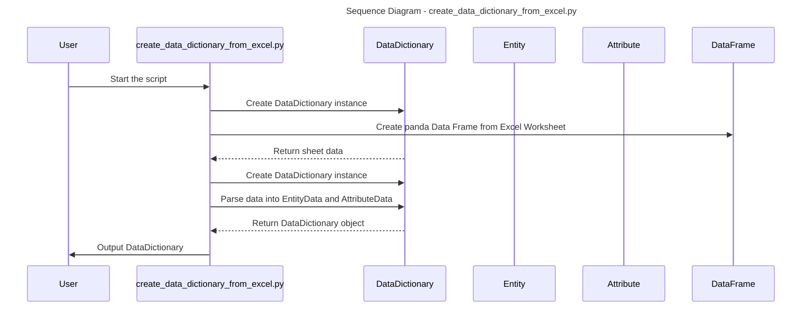
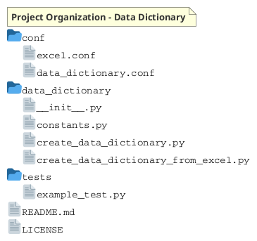
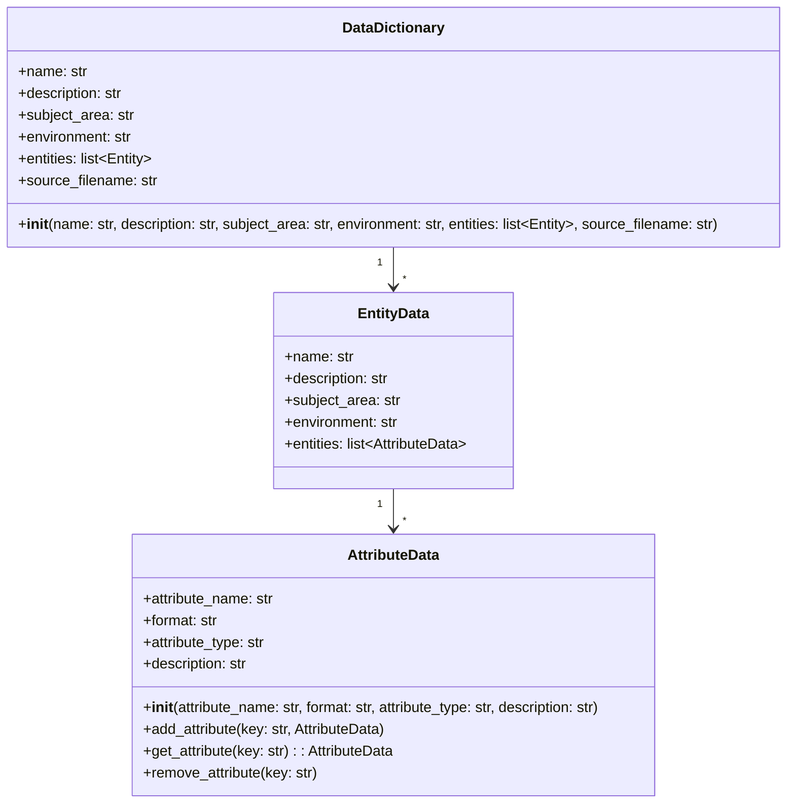
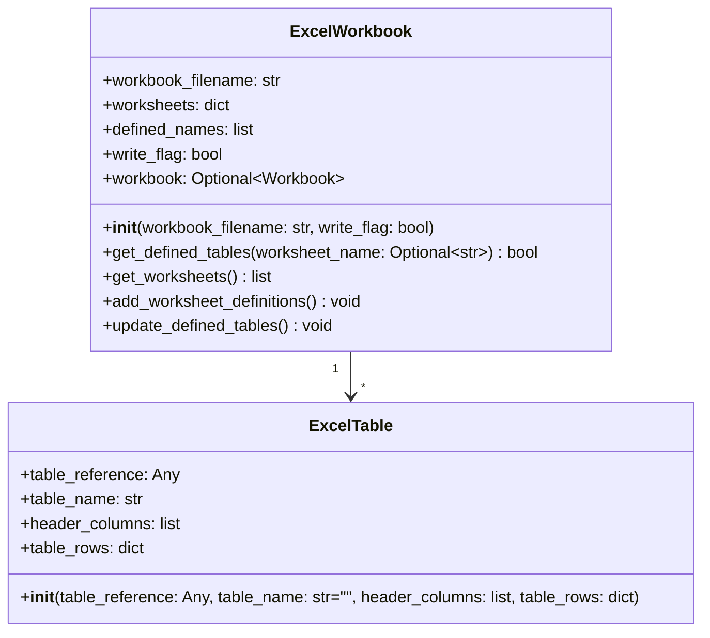
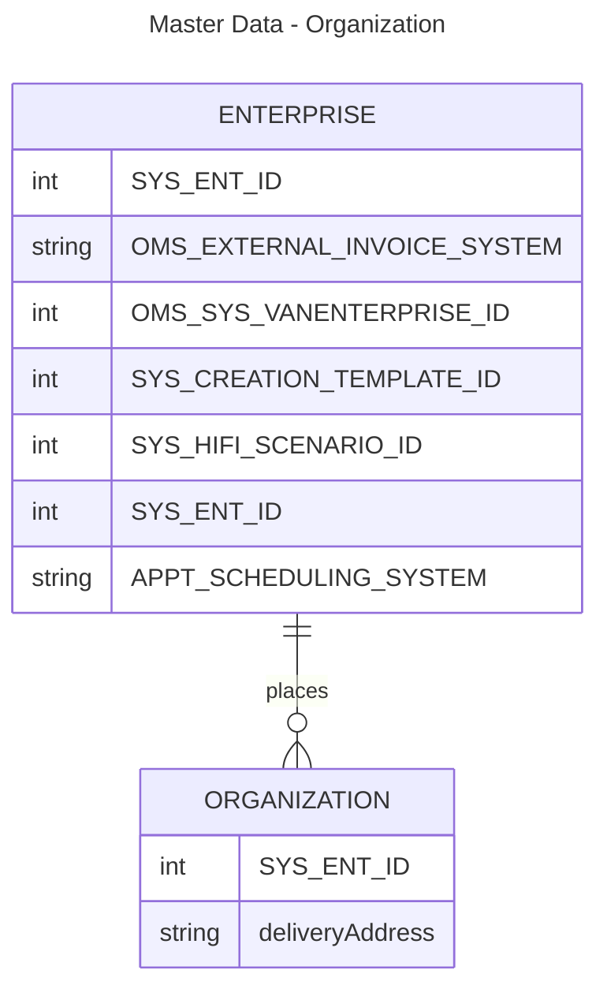
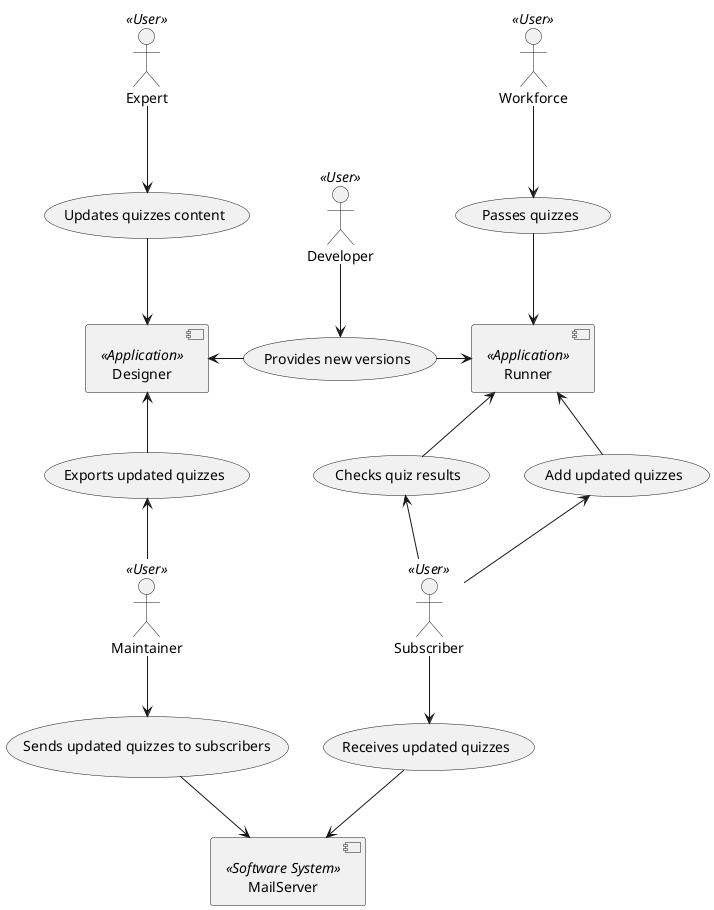
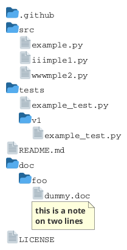

```plantuml
@startjson
{
  "DICTIONARY_NAME": "<Name for Data Dictionary>",
  "DESCRIPTION": "<Description for the Data Dictionary>",
  "SUBJECT_AREA": "Subject Area for Dictionary (e.g. OMS, etc.)",
  "ENVIRONMENT": "<Production, Test, QA, etc. if applicable>",
  "ENTITIES": [
       {
         "ENTITY_NAME": "<Name for Entity/Table>",
         "DESCRIPTION": "<Description for the Data Dictionary>",
         "SUBJECT_AREA": "Subject Area for Dictionary (e.g. OMS, etc.)",
         "ENVIRONMENT": "<Production, Test, QA, etc. if applicable>",
         "ATTRIBUTES": [
         [
             {
               "ATTRIBUTE_NAME": "<Name for Attribute/Column>",
               "DESCRIPTION": "<Description for the Data Dictionary>",
               "DATA_TYPE": "<Int, String, etc.>",
               "MAX_LENGTH": "<Int for Max length>",
               "MASK": "<Mask for element, if applicable>",
               "KEYS": ["PK/FK","PK/FK"],
               "PARENT_ENTITY_ATTRIBUTE": [
               {
               "PARENT_ENTITY_NAME": "<Name for Entity/Table>",
               "PARENT_ATTRIBUTE_NAME": "<Parent Attribute/Column Name>"
               },
               {
               "PARENT_ENTITY_NAME": "<Name for Entity/Table>",
               "PARENT_ATTRIBUTE_NAME": "<Description for the Data Dictionary>"
               }
               ]
             },
             {
               "ATTRIBUTE_NAME": "<Name for Attribute/Column>",
               "DESCRIPTION": "<Description for the Data Dictionary>",
               "DATA_TYPE": "<Int, String, etc.>",
               "MAX_LENGTH": "<Int for Max length>",
               "MASK": "<Mask for element, if applicable>",
               "KEYS": ["PK/FK","PK/FK"],
               "PARENT_ENTITY_ATTRIBUTE": [
               {
         "ENTITY_NAME": "<Name for Entity/Table>",
         "DESCRIPTION": "<Description for the Data Dictionary>",
         "SUBJECT_AREA": "Subject Area for Dictionary (e.g. OMS, etc.)",
         "ENVIRONMENT": "<Production, Test, QA, etc. if applicable>"
       },
       {
         "ENTITY_NAME": "<Name for Entity/Table>",
         "DESCRIPTION": "<Description for the Data Dictionary>",
         "SUBJECT_AREA": "Subject Area for Dictionary (e.g. OMS, etc.)",
         "ENVIRONMENT": "<Production, Test, QA, etc. if applicable>"
       }]
             }
          ]  
         ]
       },
       {
         "ENTITY_NAME": "<Name for Entity/Table>",
         "DESCRIPTION": "<Description for the Data Dictionary>",
         "SUBJECT_AREA": "Subject Area for Dictionary (e.g. OMS, etc.)",
         "ENVIRONMENT": "<Production, Test, QA, etc. if applicable>"
       }
    ]  
}
@endjson

```

# Data Dictionary

A Data Dictionary data class set of resources and code.

- [ ] Add details for each script/module/class/config/etc. into this file
  - DataDictionary Classes
  - create_data_dictionary_from_excel script
  - Configuration files
  - DataDictionary exports (JSON, etc.)
- [ ] Create function that reads in an existing Data Dictionary JSON file.
- [ ] Create sample data for PSM For Sales Order/Delivery

## Use Cases/Stories/Epics/Key Processes

1. Load existing data dictionary (generated from previous executions) information from JSON file into Data Dictionary objects (DataDictionary, Entity, Attribute)
2. A technical process that imports an Excel spreadsheet that contains data dictionary information. 
   * Each worksheet contains 1 Entities Definition
   * Creates Entity and for each row creates an Attribute
   * Imports/Uses
     * DataDictionary
     * Entity
     * Attribute
3. Export existing data dictionary objects to JSON formatted file.
   * JSON Format
   * output_files/data_dictionary.json
4. Maintain an external source (Excel, JSON, CSV, etc.) for the data dictionary that is imported as needed to add/update information from previous executions. 
5. Capture configuration details needed to ingest Excel spreadsheets containing data dictionary elements
   * JSON Format
   * data_dictionary_config.json
6. Generate various output formats of a data dictionary (e.g. Markdown, Excel, Document, diagrams, etc.)
   * Take DataDictionary instance and export it's Entities and Attributes to various formats
   * Create a set of linked pages that include data dictionary details.  This includes markdown pages.  These can be imported or otherwise used to make a data dictionary available to users.
     * Markdown
     * Excel
     * JSON
     * CSV
7. Identify and Store data model relationships (ER Parent/Child, etc.)
8. Generate Data Lineage/Traceability mapping

### 1. Load existing data dictionary (generated from previous executions) information from JSON file into Data Dictionary objects (DataDictionary, Entity, Attribute)

If a data dictionary has been previously processed and saved into a JSON formatted file, this should be loaded prior to processing subsequent data dictionary entries.

### 2. A technical process that imports an Excel spreadsheet that contains data dictionary information. 
 

* Each worksheet contains 1 Entities Definition
* Creates Entity and for each row creates an Attribute
* Imports/Uses
* DataDictionary
* Entity
* Attribute

### Export complete existing data dictionary objects to JSON formatted file.

Take an existing data dictionary and export the data into a formatted file (JSON, Markdown, etc.).  This file can be used by other processes as needed and also loaded in subsequent processing steps. 

JSON Format
output_files/data_dictionary.json

### Maintain an external source (Excel, JSON, CSV, etc.) for the data dictionary that is imported as needed to add/update information from previous executions. 

Export to Json

### Capture configuration details needed to ingest Excel spreadsheets containing data dictionary elements
   * JSON Format
   * data_dictionary_config.json

### Generate various output formats of a data dictionary (e.g. Markdown, Excel, Document, diagrams, etc.)
   * Take DataDictionary instance and export it's Entities and Attributes to various formats
   * Create a set of linked pages that include data dictionary details.  This includes markdown pages.  These can be imported or otherwise used to make a data dictionary available to users.
     * Markdown
     * Excel
     * JSON
     * CSV

### Identify and Store data model relationships (ER Parent/Child, etc.)

Parent/Child, Foreign Keys, etc.

### Generate Data Lineage/Traceability mapping

Create diagrams showing traceability.

## Scripts/Modules

### create_data_dictionary_from_excel.py

This script creates a DataDictionary object with a Excel spreadsheet identified that contains Entity and Attribute definitions.  

1. Create DataDictionary from Excel Workbook
2. Create panda DataFrame for Worksheet defined in config file that contains Entity/Attribute details
3. Create an Entity based on the Worksheet name.
4. For each row in the DataFrame create an Attribute and add it to the Entity
5. Once all attributes are added to the entity, add the entity to the DataDictionary.
6. Write a DataDictionary object to a JSON formatted file.

* main(): Main processing of script
* read_excel_table(sheet, table)
* get_all_tables()
* process_args() - Process command line arguments and save to variables.
* get_configs() - Gets config details from conf/data_dictionary.conf configuration file in .ini file format

### Sequence Diagram

## Process Flow

### Processing an Excel worksheet containing Entity/Attribute definitions

## Project Organization

This project is organized as below:

## Class Definitions

### Class - DataDictionary 

Contains a complete data dictionary including a description as well as an array of Entity class objects. 

#### DataDictionary - Properties

* name (string) - A name for the data dictionary
* description (string) - A description of the data dictionary
* subject_area (string) - The subject area name for the entity (e.g. Master Data, Orders, etc.)
* environment_name (string) - An optional property that describes that environment, business area, business process, application, etc. where the entity is defined. 
* entities (list(Entity)) - An array of Entity objects (See Entity definition below).  A Data Dictionary can be initialized with a set of entities already created.

#### DataDictionary - Methods

* __init__ -> self (class method): Initialize the Data Dictionary class
* add_entity(self, Entity) -> None: Adds a single Entity object to the Data Dictionary
* remove_entity(self, Entity) -> None: Remove an entity from the data dictionary
* get_entity(self, Entity.name) -> Entity: Gets an entity from the Data dictionary
* write_data_dictionary(self): This method is intended to write the data dictionary's content to an output file. The out_filename parameter specifies the path where the file should be saved. The specific details about how the data is formatted and written are defined within the method.

### Class - Entity

A class that defines and logical data model entity or a physical model table along with an array of Attribute objects.

#### Entity - Properties

* entity_name (string) - The name of the entity or table
* entity_description (string) - A description of the entity
* subject_area (string) - The subject area name for the entity (e.g. Master Data, Orders, etc.)
* environment_name (string) - An optional property that describes that environment, business area, business process, application, etc. where the entity is defined. 
* attributes (UserDict<Attribute>) - A dictionary containing Attribute objects (See Attribute definition below) with the attribute name as the key

#### Entity - Methods

* __init__ -> self (@classmethod): Initialize the class
* entity_from_csv -> self (@classmethod): Creates an entity from a csv value
* add_attribute(key, Attribute) -> None: Adds an attribute object
* get_attribute(key) -> Attribute: If key exists, returns the attribute
* remove_attribute(key) -> None: If exists, removes the attribute from the dictionary 

### Class - Attribute

Attribute/Field definition for an Entity based on a UserDict base class

#### Attribute - Properties

* attribute_name (string) - The name of the attribute or column
* format (string) - optional: specific format or mask for the attribute
* attribute_type (string) - The data type of the attribute
* description (string) - A description of the entity

#### Attribute - Methods

* __init__(String attribute_name) -> self (@classmethod): Initialize the class
* add_attribute(key, Attribute) -> None: Adds an attribute object
* get_attribute(key) -> Attribute: If key exists, returns the attribute
* remove_attribute(key) -> None: If exists, removes the attribute from the dictionary 

### Class - ExcelWorkbook

The ExcelWorkbook class encapsulates the operations that can be performed on an Excel workbook, including reading worksheets, listing defined tables within worksheets, and more. It's primarily focused on extracting information rather than modifying or writing new Excel files.

The `ExcelWorkbook` class is designed to facilitate the interaction with Excel spreadsheet files using the OpenPyXL library. Here's a detailed explanation of its purpose and functionality based on the flowchart:

The ExcelWorkbook and ExcelTable classes are designed to facilitate the handling of Excel spreadsheets by simplifying data extraction, manipulation, and interaction tasks. The ExcelWorkbook class represents an Excel workbook and provides functionality to interact with its contents:

#### Purpose
The `ExcelWorkbook` class encapsulates the operations that can be performed on an Excel workbook, including reading worksheets, listing defined tables within worksheets, and more. It's primarily focused on extracting information rather than modifying or writing new Excel files.

#### Functionality

1. **Initialization (`__init__`)**
    - **Parameters**: 
      - `workbook_filename`: The path to the Excel file.
      - `write_flag`: A boolean that indicates if the workbook should be opened for writing.
    - **Behavior**:
      - If the file exists and `write_flag` is `False`, it loads the workbook with data only.
      - If the file doesn't exist, it logs an error.
      - If `write_flag` is `True`, it warns that writing is not supported yet.

2. **`get_defined_tables`**
    - **Parameters**: 
      - `worksheet_name`: An optional name of a worksheet.
    - **Behavior**:
      - If no worksheet name is provided, it logs and iterates through all worksheets to print details of each table (displayName, name, type, range, and column names).
      - If a specific worksheet name is provided, it logs and prints the table details specifically for that worksheet.

3. **`get_worksheets`**
    - **Returns**:
      - A list of worksheet titles from the workbook.
    - **Behavior**:
      - Iterates through the workbook's worksheets, appending each worksheet's title to a return list.
      - Adds the worksheet to the dictionary if it doesn't already exist.

4. **`add_worksheet_definitions`**
    - **Behavior**:
      - Iterates through each worksheet in the workbook, adding worksheet titles and table data to the internal dictionary.
      - For each table in a worksheet, it gathers table data for further processing.

5. **`update_defined_tables`**
    - **Behavior**:
      - Logs the gathering of table definitions for all worksheets in the workbook.
      - Iterates through each worksheet and logs the tables being gathered from them.

Overall, the `ExcelWorkbook` class provides a structured way to interact with Excel workbooks for reading and analyzing data, particularly focused on listing worksheets and tables within them. The methods are largely designed for reporting purposes, as the class is currently focused on reading data rather than writing or modifying it.

Attributes:

workbook_filename: The name of the Excel file.
worksheets: A dictionary to store information about the worksheets in the workbook.
defined_names: A list to hold any defined names within the workbook.
write_flag: A boolean to differentiate between read and write operations.
workbook: An instance of the loaded workbook, or None if not found.
Methods:

__init__: Initializes the workbook, loading it if write_flag is False.
get_defined_tables: Retrieves tables from a specified worksheet or all worksheets.
get_worksheets: Returns a list of worksheet names in the workbook.
add_worksheet_definitions: Adds a definition of each worksheet and its tables to the worksheets dictionary.
update_defined_tables: Updates the list of defined tables in the workbook.
ExcelTable Class
The ExcelTable class represents an Excel table within a worksheet and stores data regarding the table:

Attributes:

table_reference: A reference to the Excel table.
table_name: The name of the table.
header_columns: A list of headers for the table's columns.
table_rows: A dictionary containing the rows of the table.
Methods:

__init__: Initializes the table object with its reference, name, and data.
Interaction
The ExcelWorkbook class uses the ExcelTable class to manage tables within each worksheet. When interacting with a workbook, the ExcelWorkbook methods handle loading and processing of worksheets and tables. For tasks like retrieving table data or updating tables, the ExcelWorkbook may create and manage multiple instances of ExcelTable, using these to represent and manipulate individual tables within the Excel file.

This interaction allows users to handle both the workbook as a whole and its individual tables, providing a structured and organized way to work with Excel data.

## To Do Items to Update this Python Template

- [ ] Add directions to README.md to create documentation.
- [ ] Add directions/notes for adding comment headers/blocks
- [ ] Add link/note to wiki page related to commenting Python code.
- [ ] Add Documentation regarding creating/running tests.
- [ ] Add descriptions for folders/files included in template to README.

## Generating/Updating Documentation

1. Running processes to update docs/ folder.
2. Install the sphinx plugin/module.
3. Run the sphinx-quickstart to create the initial structures
4. Update core.py to modify the path to include the project directory and add the sphinx.ext.autodoc to the extensions array.
5. Make updates to the index.rst file to include the Python resources to generate documentation for.

