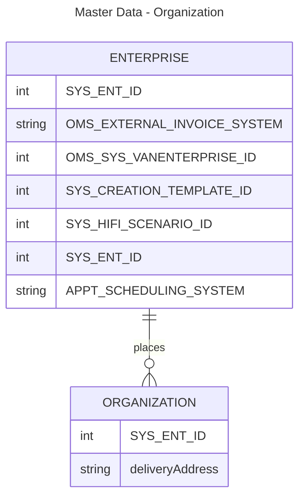

# Data Dictionary

A Data Dictionary data class set of resources and code.




## Class Definitions

### Class - DataDictionary 

Contains a complete data dictionary including a description as well as an array of Entity class objects. 

#### DataDictionary - Properties

* name (string) - A name for the data dictionary
* description (string) - A description of the data dictionary
* subject_area (string) - The subject area name for the entity (e.g. Master Data, Orders, etc.)
* environment_name (string) - An optional property that describes that environment, business area, business process, application, etc. where the entity is defined. 
* entities (List<Entity>) - An array of Entity objects (See Entity definition below).  A Data Dictionary can be initialized with a set of entities already created.

#### DataDictionary - Methods

* __init__ -> self (class method): Initialize the Data Dictionary class
* add_entity(self, Entity) -> None: Adds a single Entity object to the Data Dictionary
* remove_entity(self, Entity) -> None: Remove an entity from the data dictionary
* get_entity(self, Entity.name) -> Entity: Gets an entity from the Data dictionary

### Class - Entity

A class that defines and logical data model entity or a physical model table along with an array of Attribute objects.

#### Entity - Properties

* entity_name (string) - The name of the entity or table
* entity_description (string) - A description of the entity
* subject_area (string) - The subject area name for the entity (e.g. Master Data, Orders, etc.)
* environment_name (string) - An optional property that describes that environment, business area, business process, application, etc. where the entity is defined. 
* attributes (UserDict<Attribute>) - A dictionary containing Attribute objects (See Attribute definition below) with the attribute name as the key

#### Entity - Methods

* __init__ -> self (@classmethod): Initialize the class
* entity_from_csv -> self (@classmethod): Creates an entity from a csv value
* add_attribute(key, Attribute) -> None: Adds an attribute object
* get_attribute(key) -> Attribute: If key exists, returns the attribute
* remove_attribute(key) -> None: If exists, removes the attribute from the dictionary 

### Class - Attribute

Attribute/Field definition for an Entity based on a UserDict base class

#### Attribute - Properties

* attribute_name (string) - The name of the attribute or column
* format (string) - optional: specific format or mask for the attribute
* attribute_type (string) - The data type of the attribute
* description (string) - A description of the entity

#### Attribute - Methods

* __init__(String attribute_name) -> self (@classmethod): Initialize the class
* add_attribute(key, Attribute) -> None: Adds an attribute object
* get_attribute(key) -> Attribute: If key exists, returns the attribute
* remove_attribute(key) -> None: If exists, removes the attribute from the dictionary 

## To Do Items to Update this Python Template

- [ ] Add directions to README.md to create documentation.
- [ ] Add directions/notes for adding comment headers/blocks
- [ ] Add link/note to wiki page related to commenting Python code.
- [ ] Add Documentation regarding creating/running tests.
- [ ] Add descriptions for folders/files included in template to README.

## Generating/Updating Documentation

1. Running processes to update docs/ folder.
2. Install the sphinx plugin/module.
3. Run the sphinx-quickstart to create the initial structures
4. Update core.py to modify the path to include the project directory and add the sphinx.ext.autodoc to the extensions array.
5. Make updates to the index.rst file to include the Python resources to generate documentation for.


### Code commenting for Documentation

#### Function Header Comment Block

Add the following header to a script/module file.

```python
"""This is the summary line

This is the further elaboration of the docstring. Within this section,
you can elaborate further on details as appropriate for the situation.
Notice that the summary and the elaboration is separated by a blank new
line.
"""
```

See my confluence wiki, [Organizing Python Resources](https://davidhartman.atlassian.net/wiki/spaces/PYTHON/pages/196629) for more details.


#### Class Comment Block


```python
"""
A class used to represent an Animal

...

Attributes
----------
says_str : str
    a formatted string to print out what the animal says
name : str
    the name of the animal
sound : str
    the sound that the animal makes
num_legs : int
    the number of legs the animal has (default 4)

Methods
-------
says(sound=None)
    Prints the animals name and what sound it makes
"""
```